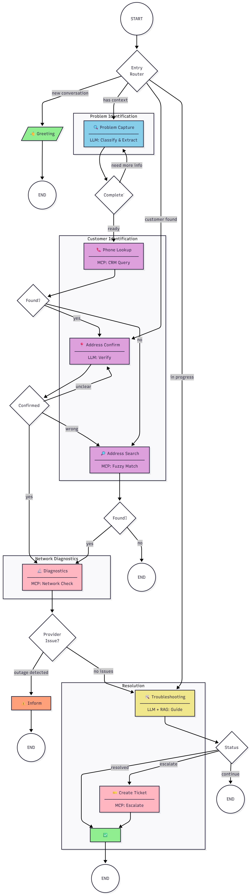
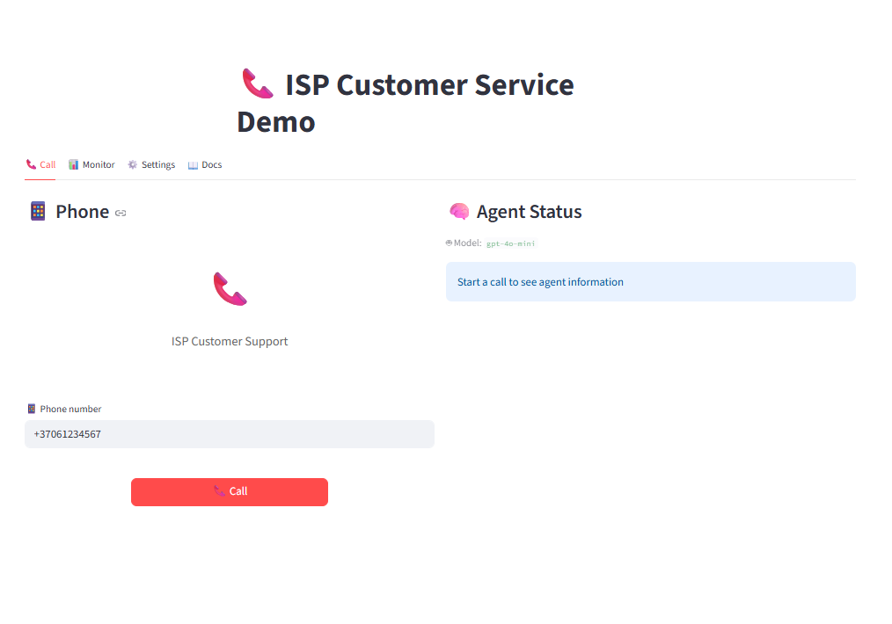

# ISP Customer Service Chatbot

> **⚠️ DEMO / Proof of Concept**  
> This is a demonstration project showcasing AI agent architecture for ISP customer support. The database, knowledge base documents, and troubleshooting scenarios are simulated for demonstration purposes.

An intelligent conversational agent prototype designed to automate customer support operations for Internet Service Providers. Built with LangGraph workflow orchestration, the system demonstrates the complete customer service lifecycle — from initial problem identification through guided troubleshooting to ticket escalation.

## Project Overview

This proof-of-concept demonstrates how modern AI technologies can be combined to create an intelligent customer service agent. The project showcases:

- **LangGraph workflow orchestration** — state machine architecture for complex conversation flows
- **Multi-LLM support** — switchable providers (Claude, OpenAI, Gemini) with model selection
- **RAG-based knowledge retrieval** — context-aware troubleshooting with hybrid search
- **MCP tool integration** — standardized protocol for external service communication
- **Real-time monitoring** — LLM call tracking, cost calculation, and state inspection

The demo includes simulated CRM data, mock network diagnostics, and sample troubleshooting scenarios to illustrate the system's capabilities. For production deployment, these components would need to be replaced with real integrations.

### What Would Be Needed for Production

| Component | Demo State | Production Requirements |
|-----------|------------|------------------------|
| Knowledge Base | Sample troubleshooting docs | Real ISP documentation, verified procedures |
| CRM Integration | SQLite with mock data | Live CRM API connection |
| Network Diagnostics | Simulated responses | Real network monitoring tools integration |
| Troubleshooting Scenarios | Example flows | Field-tested, validated resolution paths |
| Workflow Logic | Basic routing | Fine-tuned based on real conversation data |

---

## Key Capabilities

| Capability | Description |
|------------|-------------|
| **Intelligent Problem Classification** | LLM-powered categorization (internet, TV, billing) with context extraction |
| **Customer Identification** | Phone-based lookup with address verification and fuzzy matching |
| **Automated Network Diagnostics** | Simulated checks for area outages, port status, and IP assignment |
| **Guided Troubleshooting** | RAG-powered step-by-step resolution with smart scenario selection |
| **Context-Aware Routing** | Skips redundant steps based on information customer already provided |
| **Automatic Ticket Creation** | Seamless escalation with full troubleshooting history |
| **Multi-LLM Support** | Switchable between OpenAI and Gemini providers |
| **Bilingual Interface** | Lithuanian and English conversation modes |
| **Real-time Monitoring** | LLM call tracking, cost estimation, RAG document visibility |
| **State Inspection** | Debug tools for workflow and conversation state analysis |

---

## Agent Workflow

The agent operates through a directed graph of specialized nodes, each responsible for a specific phase of the customer service process.

### Workflow Graph



### Node Reference

| Node | Purpose | Technology |
|------|---------|------------|
| `greeting` | Welcome message display | Static config |
| `problem_capture` | Problem classification and context extraction | LLM (Claude) |
| `phone_lookup` | Customer identification by phone | MCP → CRM |
| `address_confirmation` | Service address verification | LLM (Claude) |
| `address_search` | Fuzzy address matching | MCP → CRM |
| `diagnostics` | Network status verification | MCP → Network |
| `inform_provider_issue` | Outage notification | Static message |
| `troubleshooting` | Guided step-by-step resolution | LLM + RAG |
| `create_ticket` | Support ticket generation | MCP → CRM |
| `closing` | Conversation summary and farewell | Static message |

→ *Detailed workflow documentation: [docs/WORKFLOW.md](docs/WORKFLOW.md)*

---

## Demo UI Features

The Streamlit-based interface provides comprehensive tools for testing and monitoring the agent:

### LLM Configuration
- **Provider Selection** — Switch between Claude (Anthropic), OpenAI, and Gemini
- **Model Selection** — Choose specific models per provider
- **Language Selection** — Lithuanian / English conversation mode

### Real-time Monitoring
- **LLM Call Tracking** — Count of API calls per conversation
- **Cost Calculation** — Estimated token usage and cost
- **RAG Document Display** — Shows which knowledge base documents were retrieved
- **Response Latency** — Time tracking for each operation

### Debug Tools
- **Conversation State Viewer** — Inspect full Pydantic state at any point
- **Node Transition Log** — Track workflow progression
- **Message History** — Full conversation with metadata



```
┌─────────────────────────────────────────────────────────────────┐
│  Demo UI Layout                                                  │
├─────────────────────────────────────────────────────────────────┤
│                                                                  │
│  ┌─────────────┐  ┌─────────────────────────────────────────┐   │
│  │ Settings    │  │  Chat Interface                         │   │
│  │ ─────────── │  │                                         │   │
│  │ Provider: ▼ │  │  🤖 Agent: Sveiki! Kuo galiu padėti?   │   │
│  │ Model:    ▼ │  │                                         │   │
│  │ Language: ▼ │  │  👤 You: Neveikia internetas           │   │
│  │             │  │                                         │   │
│  ├─────────────┤  │  🤖 Agent: Suprantu...                  │   │
│  │ Monitoring  │  │                                         │   │
│  │ ─────────── │  └─────────────────────────────────────────┘   │
│  │ LLM Calls: 5│                                                │
│  │ Cost: $0.02 │  ┌─────────────────────────────────────────┐   │
│  │ Latency: 1.2s│ │  State Inspector                        │   │
│  │             │  │  ─────────────────                       │   │
│  ├─────────────┤  │  customer_id: CUST001                   │   │
│  │ RAG Results │  │  problem_type: internet                 │   │
│  │ ─────────── │  │  current_node: troubleshooting          │   │
│  │ 📄 doc1.md │  │  troubleshooting_step: 2                │   │
│  │ 📄 doc2.md │  │  ...                                     │   │
│  └─────────────┘  └─────────────────────────────────────────┘   │
│                                                                  │
└─────────────────────────────────────────────────────────────────┘
```

→ *Details: [docs/UI.md](docs/UI.md)*

---

## What Makes It Smart

### 1. LangGraph Workflow Engine

The agent uses LangGraph's state machine architecture for deterministic conversation flow with intelligent routing decisions.

```
┌─────────────┐     ┌─────────────┐     ┌─────────────┐
│   State     │────▶│    Node     │────▶│   Router    │
│  (Pydantic) │     │  (Action)   │     │ (Decision)  │
└─────────────┘     └─────────────┘     └──────┬──────┘
                                               │
                    ┌──────────────────────────┼──────────────────────────┐
                    ▼                          ▼                          ▼
              [Next Node A]              [Next Node B]              [END]
```

**Key Features:**
- Pydantic-based state validation
- Conditional routing based on conversation context  
- Memory persistence across conversation turns
- Error recovery with graceful fallbacks

→ *Details: [docs/WORKFLOW.md](docs/WORKFLOW.md)*

---

### 2. MCP Tools Integration

Model Context Protocol (MCP) enables standardized communication with external services.

| Tool | Server | Purpose |
|------|--------|---------|
| `lookup_customer_by_phone` | CRM Service | Find customer by phone number |
| `lookup_customer_by_address` | CRM Service | Fuzzy address matching |
| `get_customer_details` | CRM Service | Retrieve services & equipment |
| `create_ticket` | CRM Service | Generate support tickets |
| `check_area_outages` | Network Service | Detect regional issues *(simulated)* |
| `check_port_status` | Network Service | Verify connection status *(simulated)* |

```
┌──────────────┐      JSON-RPC       ┌──────────────┐      SQL      ┌──────────┐
│  Workflow    │◄───────────────────►│  MCP Server  │◄─────────────►│  SQLite  │
│    Node      │                     │  (CRM/Net)   │               │  (Demo)  │
└──────────────┘                     └──────────────┘               └──────────┘
```

→ *Details: [docs/MCP_TOOLS.md](docs/MCP_TOOLS.md)*

---

### 3. RAG Knowledge System

Retrieval-Augmented Generation provides context-aware troubleshooting guidance using sample documentation.

```
┌─────────────────────────────────────────────────────────────────┐
│                      RAG Pipeline                                │
├─────────────────────────────────────────────────────────────────┤
│                                                                  │
│   Query: "internet connection drops"                            │
│                     │                                            │
│                     ▼                                            │
│   ┌─────────────────────────────────┐                           │
│   │      Embedding Manager          │                           │
│   │   (paraphrase-multilingual)     │                           │
│   └────────────────┬────────────────┘                           │
│                    │                                             │
│          ┌─────────┴─────────┐                                  │
│          ▼                   ▼                                   │
│   ┌─────────────┐    ┌──────────────┐                           │
│   │  Semantic   │    │   Keyword    │                           │
│   │   Search    │    │   Matching   │                           │
│   │   (FAISS)   │    │  (Technical) │                           │
│   │    70%      │    │     30%      │                           │
│   └──────┬──────┘    └──────┬───────┘                           │
│          │                  │                                    │
│          └────────┬─────────┘                                    │
│                   ▼                                              │
│   ┌─────────────────────────────────┐                           │
│   │     Hybrid Re-ranking           │                           │
│   │   + Scenario Selection          │                           │
│   └─────────────────────────────────┘                           │
│                                                                  │
└─────────────────────────────────────────────────────────────────┘
```

**Capabilities:**
- Hybrid search combining semantic similarity and keyword matching
- Multilingual embeddings (768 dimensions)
- YAML-based troubleshooting scenarios
- Smart routing based on problem context

→ *Details: [docs/RAG_SYSTEM.md](docs/RAG_SYSTEM.md)*

---

### 4. Intelligent Troubleshooting

The system selects optimal troubleshooting scenarios and adapts to customer context.

**Smart Routing Logic:**
```
Problem Context Analysis
         │
         ├─── Single device affected? ──────► internet_single_device
         │
         ├─── Connection intermittent? ─────► internet_intermittent  
         │
         ├─── Slow speed reported? ─────────► internet_slow
         │
         └─── Default ──────────────────────► internet_no_connection
```

**Adaptive Features:**
- Skips steps customer already tried (based on problem_context)
- Detects help requests and provides detailed explanations
- Recognizes resolution confirmation (explicit and implicit)
- Escalates appropriately with full context preservation

→ *Details: [docs/TROUBLESHOOTING_SCENARIOS.md](docs/TROUBLESHOOTING_SCENARIOS.md)*

---

## Architecture Overview

```
┌─────────────────────────────────────────────────────────────────────────────┐
│                         ISP Customer Service Bot                             │
├─────────────────────────────────────────────────────────────────────────────┤
│                                                                              │
│   ┌────────────────────────────────────────────────────────────────────┐    │
│   │                        Interface Layer                              │    │
│   │  ┌──────────────┐   ┌──────────────┐   ┌──────────────┐            │    │
│   │  │  Streamlit   │   │   CLI Chat   │   │   REST API   │            │    │
│   │  │   Demo UI    │   │  Interface   │   │   (Future)   │            │    │
│   │  └──────────────┘   └──────────────┘   └──────────────┘            │    │
│   └────────────────────────────────────────────────────────────────────┘    │
│                                      │                                       │
│   ┌────────────────────────────────────────────────────────────────────┐    │
│   │                        Core Engine                                  │    │
│   │                                                                     │    │
│   │   ┌─────────────────────────────────────────────────────────┐      │    │
│   │   │              LangGraph Workflow Engine                   │      │    │
│   │   │         (State Machine + Conditional Routing)            │      │    │
│   │   └─────────────────────────────────────────────────────────┘      │    │
│   │                              │                                      │    │
│   │          ┌───────────────────┼───────────────────┐                 │    │
│   │          ▼                   ▼                   ▼                 │    │
│   │   ┌────────────┐     ┌─────────────┐     ┌────────────┐           │    │
│   │   │    LLM     │     │     MCP     │     │    RAG     │           │    │
│   │   │  Service   │     │   Clients   │     │  System    │           │    │
│   │   │  (Claude)  │     │             │     │  (FAISS)   │           │    │
│   │   └────────────┘     └──────┬──────┘     └────────────┘           │    │
│   │                             │                                      │    │
│   └─────────────────────────────│──────────────────────────────────────┘    │
│                                 │                                            │
│   ┌─────────────────────────────│──────────────────────────────────────┐    │
│   │                        External Services                            │    │
│   │                             │                                       │    │
│   │          ┌──────────────────┼──────────────────┐                   │    │
│   │          ▼                                     ▼                   │    │
│   │   ┌─────────────┐                      ┌─────────────┐             │    │
│   │   │ CRM Service │                      │  Network    │             │    │
│   │   │ MCP Server  │                      │  Diagnostics│             │    │
│   │   └──────┬──────┘                      └──────┬──────┘             │    │
│   │          │                                    │                    │    │
│   │          └────────────────┬───────────────────┘                    │    │
│   │                           ▼                                        │    │
│   │                    ┌─────────────┐                                 │    │
│   │                    │   SQLite    │                                 │    │
│   │                    │  Database   │                                 │    │
│   │                    └─────────────┘                                 │    │
│   └────────────────────────────────────────────────────────────────────┘    │
│                                                                              │
└─────────────────────────────────────────────────────────────────────────────┘
```

→ *Details: [docs/ARCHITECTURE.md](docs/ARCHITECTURE.md)*

---

## Technology Stack

| Category | Technology | Purpose |
|----------|------------|---------|
| **Orchestration** | LangGraph | Workflow state machine |
| **LLM Gateway** | LiteLLM | Multi-provider support (OpenAI, Gemini) |
| **Embeddings** | sentence-transformers | Multilingual text embeddings |
| **Vector Store** | FAISS | Similarity search |
| **Tool Protocol** | MCP (Model Context Protocol) | External service integration |
| **Database** | SQLite | Customer and ticket data (demo) |
| **State Management** | Pydantic | Type-safe state validation |
| **Configuration** | YAML | Scenarios, translations, settings |
| **UI** | Streamlit | Demo interface with monitoring |
| **Language** | Python 3.11+ | Primary development language |

---

## Quick Start

```bash
# 1. Clone repository
git clone https://github.com/your-org/isp-chatbot.git
cd isp-chatbot

# 2. Create virtual environment
python -m venv venv
source venv/bin/activate  # Windows: venv\Scripts\activate

# 3. Install dependencies
pip install -e ".[dev]"

# 4. Initialize database
python scripts/init_database.py

# 5. Start MCP servers (separate terminal)
python -m crm_service.src.crm_mcp.server

# 6. Run chatbot
streamlit run chatbot_core/src/streamlit_ui/app.py

uv run streamlit run chatbot_core\src\streamlit_ui\app.py
```

chatbot_core\src\streamlit_ui\app.py

→ *Full installation guide: [docs/INSTALLATION.md](docs/INSTALLATION.md)*

---


## Documentation

| Document | Description |
|----------|-------------|
| [ARCHITECTURE.md](isp-customer-service/docs/ARCHITECTURE.md) | System architecture and design decisions |
| [WORKFLOW.md](isp-customer-service/docs/WORKFLOW.md) | LangGraph nodes and routing logic |
| [MCP_TOOLS.md](isp-customer-service/docs/MCP_TOOLS.md) | MCP servers and tool specifications |
| [RAG_SYSTEM.md](isp-customer-service/docs/RAG_SYSTEM.md) | Knowledge retrieval pipeline |
| [CONFIGURATION.md](docs/CONFIGURATION.md) | YAML configuration reference |
| [INSTALLATION.md](docs/INSTALLATION.md) | Setup and deployment guide |


---
