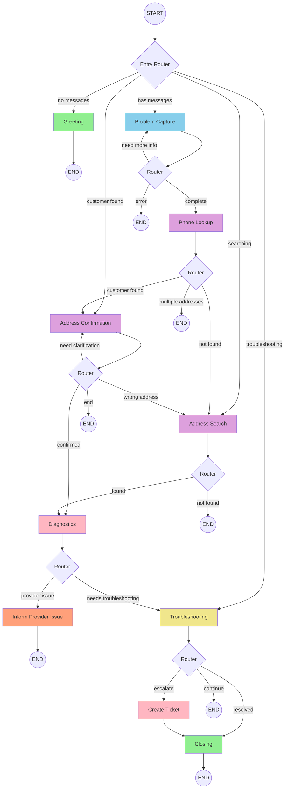

# ISP Customer Service Chatbot

## Complete Technical Documentation

---

## Table of Contents

1. [Project Overview](#project-overview)
2. [Architecture](#architecture)
3. [Workflow Graph](#workflow-graph)
4. [Node Reference](#node-reference)
5. [State Schema](#state-schema)
6. [Routing Logic](#routing-logic)
7. [MCP Tools](#mcp-tools)
8. [RAG System](#rag-system)
9. [Troubleshooting Scenarios](#troubleshooting-scenarios)
10. [Technology Stack](#technology-stack)
11. [Configuration](#configuration)
12. [API Reference](#api-reference)

---

## Project Overview

### Purpose

An AI-powered customer service chatbot for Internet Service Providers (ISPs) that:

- Handles incoming support calls automatically
- Identifies customers by phone number
- Diagnoses network issues
- Guides customers through troubleshooting
- Creates support tickets when needed
- Supports Lithuanian and English languages

### Key Features

| Feature | Description |
|---------|-------------|
| **Multi-language** | Lithuanian (primary) + English support |
| **Customer Identification** | Phone lookup, address confirmation |
| **Network Diagnostics** | Automated provider-side checks |
| **Guided Troubleshooting** | Step-by-step resolution with RAG |
| **Smart Routing** | Context-aware scenario selection |
| **Ticket Creation** | Automatic escalation to technicians |

### Project Structure

```
isp-customer-service/
├── chatbot_core/           # Main chatbot application
│   ├── src/
│   │   ├── graph/          # LangGraph workflow
│   │   ├── rag/            # Retrieval system
│   │   ├── services/       # LLM, MCP, utilities
│   │   ├── config/         # YAML configurations
│   │   ├── locales/        # Translations
│   │   ├── prompts/        # LLM prompts
│   │   └── streamlit_ui/   # Demo interface
│   └── tests/
├── crm_service/            # MCP server for CRM
├── database/               # SQLite + schemas
├── shared/                 # Shared utilities
└── docs/                   # Documentation
```

---

## Architecture

### High-Level Architecture

```
┌─────────────────────────────────────────────────────────────────────────────┐
│                           ISP Customer Service Bot                           │
├─────────────────────────────────────────────────────────────────────────────┤
│                                                                              │
│  ┌──────────────┐    ┌──────────────┐    ┌──────────────┐                   │
│  │   Streamlit  │    │   CLI Chat   │    │   API        │                   │
│  │   Demo UI    │    │   Interface  │    │   (Future)   │                   │
│  └──────┬───────┘    └──────┬───────┘    └──────┬───────┘                   │
│         │                   │                   │                            │
│         └───────────────────┴───────────────────┘                            │
│                             │                                                │
│                    ┌────────▼────────┐                                       │
│                    │   LangGraph     │                                       │
│                    │   Workflow      │                                       │
│                    │   Engine        │                                       │
│                    └────────┬────────┘                                       │
│                             │                                                │
│         ┌───────────────────┼───────────────────┐                           │
│         │                   │                   │                            │
│  ┌──────▼──────┐    ┌───────▼───────┐   ┌──────▼──────┐                     │
│  │   LLM       │    │   MCP         │   │   RAG       │                     │
│  │   Service   │    │   Clients     │   │   System    │                     │
│  │  (Claude)   │    │               │   │             │                     │
│  └─────────────┘    └───────┬───────┘   └─────────────┘                     │
│                             │                                                │
│                    ┌────────▼────────┐                                       │
│                    │   MCP Servers   │                                       │
│                    │  ┌───────────┐  │                                       │
│                    │  │CRM Service│  │                                       │
│                    │  │Network Dx │  │                                       │
│                    │  └───────────┘  │                                       │
│                    └────────┬────────┘                                       │
│                             │                                                │
│                    ┌────────▼────────┐                                       │
│                    │   SQLite DB     │                                       │
│                    │   (Customers,   │                                       │
│                    │    Tickets,     │                                       │
│                    │    Network)     │                                       │
│                    └─────────────────┘                                       │
│                                                                              │
└─────────────────────────────────────────────────────────────────────────────┘
```

### Component Interaction

```
User Input
    │
    ▼
┌─────────────────┐
│  Entry Router   │ ─── Determines which node to activate
└────────┬────────┘
         │
         ▼
┌─────────────────┐     ┌─────────────────┐
│  Workflow Node  │────▶│  LLM Service    │ ─── Claude API
└────────┬────────┘     └─────────────────┘
         │
         ├──────────────▶ MCP Tools (CRM, Network)
         │
         ├──────────────▶ RAG Retrieval (Knowledge Base)
         │
         ▼
┌─────────────────┐
│  Node Router    │ ─── Determines next node
└────────┬────────┘
         │
         ▼
    Next Node or END
```

---

## Workflow Graph

### Visual Graph (Mermaid)



### Graph Flow Description

```
┌─────────────────────────────────────────────────────────────────────────────┐
│                        CONVERSATION FLOW                                     │
├─────────────────────────────────────────────────────────────────────────────┤
│                                                                              │
│  PHASE 1: GREETING                                                          │
│  ┌─────────┐                                                                │
│  │ START   │──▶ greeting ──▶ END (wait for user input)                     │
│  └─────────┘                                                                │
│                                                                              │
│  PHASE 2: PROBLEM IDENTIFICATION                                            │
│  ┌─────────┐    ┌─────────────────┐                                         │
│  │  User   │──▶ │ problem_capture │◀─┐                                      │
│  │ Input   │    │                 │  │ (loop until clear)                   │
│  └─────────┘    └────────┬────────┘──┘                                      │
│                          │                                                   │
│                          ▼                                                   │
│  PHASE 3: CUSTOMER IDENTIFICATION                                           │
│                 ┌──────────────┐                                            │
│                 │ phone_lookup │                                            │
│                 └──────┬───────┘                                            │
│                        │                                                     │
│         ┌──────────────┼──────────────┐                                     │
│         ▼              ▼              ▼                                     │
│  ┌────────────┐ ┌────────────┐ ┌─────────────┐                              │
│  │ address_   │ │ address_   │ │  (multi     │                              │
│  │confirmation│ │ search     │ │  address)   │                              │
│  └─────┬──────┘ └─────┬──────┘ └─────────────┘                              │
│        │              │                                                      │
│        └──────┬───────┘                                                      │
│               ▼                                                              │
│  PHASE 4: DIAGNOSTICS                                                        │
│        ┌─────────────┐                                                       │
│        │ diagnostics │                                                       │
│        └──────┬──────┘                                                       │
│               │                                                              │
│        ┌──────┴──────┐                                                       │
│        ▼             ▼                                                       │
│  ┌───────────┐ ┌─────────────────┐                                          │
│  │ provider  │ │ troubleshooting │◀─┐                                       │
│  │ issue     │ │                 │  │ (guided steps)                        │
│  └─────┬─────┘ └────────┬────────┘──┘                                       │
│        │                │                                                    │
│        ▼                ├──────────────┐                                     │
│       END               ▼              ▼                                     │
│                   ┌──────────┐  ┌─────────────┐                              │
│  PHASE 5:        │ closing  │  │create_ticket│                              │
│  RESOLUTION      └────┬─────┘  └──────┬──────┘                              │
│                       │               │                                      │
│                       └───────┬───────┘                                      │
│                               ▼                                              │
│                              END                                             │
│                                                                              │
└─────────────────────────────────────────────────────────────────────────────┘
```

---

## Node Reference

### Node Overview

| Node | Purpose | LLM | MCP | RAG |
|------|---------|-----|-----|-----|
| `greeting` | Welcome message | ❌ | ❌ | ❌ |
| `problem_capture` | Identify & qualify problem | ✅ | ❌ | ❌ |
| `phone_lookup` | Find customer by phone | ❌ | ✅ | ❌ |
| `address_confirmation` | Confirm service address | ✅ | ❌ | ❌ |
| `address_search` | Search by address | ❌ | ✅ | ❌ |
| `diagnostics` | Check provider issues | ❌ | ✅ | ❌ |
| `inform_provider_issue` | Notify about outages | ❌ | ❌ | ❌ |
| `troubleshooting` | Guide through fixes | ✅ | ❌ | ✅ |
| `create_ticket` | Create support ticket | ❌ | ✅ | ❌ |
| `closing` | End conversation | ❌ | ❌ | ❌ |

### Detailed Node Descriptions

#### 1. Greeting Node

```python
# Location: src/graph/nodes/greeting.py

Purpose: Display welcome message from configuration

Input:  Empty state (new conversation)
Output: Welcome message added to messages

Flow:   START → greeting → END
```

#### 2. Problem Capture Node

```python
# Location: src/graph/nodes/problem_capture.py

Purpose: Extract and qualify customer's problem using LLM

Features:
- Problem type classification (internet/tv/phone/billing/other)
- Context extraction (duration, scope, tried_restart, etc.)
- Qualifying questions (max 3)
- Context score calculation

LLM Output Schema:
{
    "problem_type": "internet",
    "problem_summary": "Internet not working since yesterday",
    "known_facts": {
        "duration": "since yesterday",
        "scope": "all devices",
        "tried_restart": true
    },
    "context_score": 75,
    "ready_to_proceed": true,
    "next_question": null
}

Routing:
- context_score >= threshold → phone_lookup
- questions < max_questions → problem_capture (loop)
- error → end
```

#### 3. Phone Lookup Node

```python
# Location: src/graph/nodes/phone_lookup.py

Purpose: Find customer in CRM by phone number

MCP Tool: lookup_customer_by_phone

Outcomes:
- Single customer found → address_confirmation
- Multiple addresses → address_selection (TODO)
- Not found → address_search
```

#### 4. Address Confirmation Node

```python
# Location: src/graph/nodes/address_confirmation.py

Purpose: Confirm customer's service address

LLM Task: Understand if user confirms or denies address

Outcomes:
- Confirmed → diagnostics
- Wrong address → address_search
- Unclear → address_confirmation (ask again)
```

#### 5. Address Search Node

```python
# Location: src/graph/nodes/address_search.py

Purpose: Find customer by address when phone lookup fails

MCP Tool: lookup_customer_by_address

Outcomes:
- Found → diagnostics
- Not found → closing (cannot help)
```

#### 6. Diagnostics Node

```python
# Location: src/graph/nodes/diagnostics.py

Purpose: Check for provider-side issues

Checks Performed:
1. Area outages (critical)
2. Port status
3. IP assignment

MCP Tools:
- check_area_outages
- check_port_status
- check_ip_assignment

Outcomes:
- Area outage detected → inform_provider_issue
- No provider issues → troubleshooting
```

#### 7. Inform Provider Issue Node

```python
# Location: src/graph/nodes/inform_provider_issue.py

Purpose: Inform customer about known provider issues

Message Content:
- Issue type (outage, maintenance)
- Estimated fix time
- Apology and ticket offer
```

#### 8. Troubleshooting Node

```python
# Location: src/graph/nodes/troubleshooting.py

Purpose: Guide customer through step-by-step troubleshooting

Features:
- RAG-based scenario selection
- Smart routing (skip already-tried steps)
- Resolution detection
- Help request handling
- Escalation logic

LLM Tasks:
1. Analyze user response (ResolutionCheck)
2. Generate step instructions
3. Provide help when requested

Outcomes:
- Problem resolved → closing
- Needs escalation → create_ticket
- Continue → end (wait for user)
```

#### 9. Create Ticket Node

```python
# Location: src/graph/nodes/create_ticket.py

Purpose: Create support ticket for escalation

MCP Tool: create_ticket

Ticket Types:
- network_issue
- technician_visit
- resolved
- customer_not_found
```

#### 10. Closing Node

```python
# Location: src/graph/nodes/closing.py

Purpose: End conversation gracefully

Message: Thank customer, provide ticket info if created
```

---

## State Schema

### Pydantic State Model

```python
class State(BaseModel):
    """Conversation state for ISP support agent."""
    
    # === Conversation ===
    conversation_id: str
    started_at: str
    messages: Annotated[list[dict], operator.add]
    current_node: str = "start"
    
    # === Customer ===
    phone_number: str                    # From caller ID
    customer_id: str | None              # From CRM lookup
    customer_name: str | None
    customer_addresses: list[dict]       # May have multiple
    confirmed_address_id: str | None
    confirmed_address: str | None        # Human-readable
    
    # === Problem ===
    problem_type: Literal["internet", "tv", "phone", "billing", "other"] | None
    problem_description: str | None
    problem_context: dict                # Extracted facts
    qualifying_questions_asked: int
    qualifying_answers: list[dict]
    problem_capture_complete: bool
    
    # === Workflow Control ===
    needs_address_confirmation: bool
    needs_address_selection: bool
    address_confirmed: bool | None
    address_search_successful: bool | None
    
    # === Diagnostics ===
    diagnostics_completed: bool
    provider_issue_detected: bool
    needs_troubleshooting: bool
    provider_issue_informed: bool
    diagnostic_results: dict
    
    # === Troubleshooting ===
    troubleshooting_scenario_id: str | None
    troubleshooting_current_step: int
    troubleshooting_completed_steps: list
    troubleshooting_needs_escalation: bool
    troubleshooting_escalation_reason: str | None
    troubleshooting_skipped_steps: list
    troubleshooting_checked_items: dict
    troubleshooting_failed: bool
    problem_resolved: bool
    
    # === Ticket ===
    ticket_created: bool
    ticket_id: str | None
    ticket_type: str | None
    
    # === End State ===
    conversation_ended: bool
    last_error: str | None
    llm_error_count: int
```

### Problem Context Structure

```python
problem_context = {
    # Extracted facts
    "duration": "nuo vakar",           # How long problem exists
    "scope": "visi įrenginiai",        # Affected devices
    "tried_restart": True,             # Already tried restart?
    "router_lights": "nedega",         # Router LED status
    "wifi_visible": True,              # Can see WiFi network?
    "connection_pattern": "nutrūkinėja", # Intermittent/slow/none
    
    # Calculated
    "context_score": 85,               # 0-100 completeness score
}
```

### Message Structure

```python
message = {
    "role": "user" | "assistant" | "system",
    "content": "Message text",
    "node": "problem_capture",         # Which node created this
    "timestamp": "2024-01-15T10:30:00"
}
```

---

## Routing Logic

### Entry Router

```python
def entry_router(state) -> str:
    """Determine entry point based on conversation state."""
    
    # New conversation
    if not messages:
        return "greeting"
    
    # In troubleshooting flow
    if troubleshooting_scenario_id:
        return "troubleshooting"
    
    # Diagnostics completed
    if diagnostics_completed:
        return "troubleshooting"
    
    # Address search flow
    if customer_id is None and problem_description and address_search_successful is None:
        return "address_search"
    
    # Customer found, need address confirmation
    if customer_id and address_confirmed is None:
        return "address_confirmation"
    
    # Default: problem capture
    return "problem_capture"
```

### Routing Decision Table

| Current Node | Condition | Next Node |
|-------------|-----------|-----------|
| `greeting` | Always | END |
| `problem_capture` | `problem_capture_complete` | `phone_lookup` |
| `problem_capture` | Need more info | `problem_capture` |
| `problem_capture` | Error | END |
| `phone_lookup` | Customer found | `address_confirmation` |
| `phone_lookup` | Multiple addresses | END (TODO) |
| `phone_lookup` | Not found | `address_search` |
| `address_confirmation` | Confirmed | `diagnostics` |
| `address_confirmation` | Wrong address | `address_search` |
| `address_confirmation` | Unclear | `address_confirmation` |
| `address_search` | Found | `diagnostics` |
| `address_search` | Not found | END |
| `diagnostics` | Provider issue | `inform_provider_issue` |
| `diagnostics` | No issues | `troubleshooting` |
| `inform_provider_issue` | Always | END |
| `troubleshooting` | Resolved | `closing` |
| `troubleshooting` | Escalate | `create_ticket` |
| `troubleshooting` | Continue | END |
| `create_ticket` | Always | `closing` |
| `closing` | Always | END |

---

## MCP Tools

### CRM Service Tools

Located in: `crm_service/src/crm_mcp/server.py`

#### lookup_customer_by_phone

```python
Tool(
    name="lookup_customer_by_phone",
    description="Find customer by phone number",
    inputSchema={
        "type": "object",
        "properties": {
            "phone_number": {
                "type": "string",
                "description": "Phone number (e.g., '+37060000000')"
            }
        },
        "required": ["phone_number"]
    }
)

# Response
{
    "success": True,
    "customer": {
        "customer_id": "CUST001",
        "name": "Jonas Jonaitis",
        "phone": "+37060000000",
        "addresses": [
            {
                "address_id": "ADDR001",
                "city": "Šiauliai",
                "street": "Tilžės g.",
                "house_number": "12",
                "apartment": "5"
            }
        ]
    }
}
```

#### lookup_customer_by_address

```python
Tool(
    name="lookup_customer_by_address",
    description="Find customer by address with fuzzy matching",
    inputSchema={
        "type": "object",
        "properties": {
            "city": {"type": "string"},
            "street": {"type": "string"},
            "house_number": {"type": "string"},
            "apartment_number": {"type": "string"}
        },
        "required": ["city", "street", "house_number"]
    }
)
```

#### get_customer_details

```python
Tool(
    name="get_customer_details",
    description="Get detailed customer info including services and equipment",
    inputSchema={
        "type": "object",
        "properties": {
            "customer_id": {"type": "string"}
        },
        "required": ["customer_id"]
    }
)

# Response
{
    "customer_id": "CUST001",
    "name": "Jonas Jonaitis",
    "services": [
        {"service_id": "SVC001", "type": "internet", "speed": "100Mbps"}
    ],
    "equipment": [
        {"equipment_id": "EQ001", "type": "router", "model": "Archer C7"}
    ]
}
```

#### get_customer_equipment

```python
Tool(
    name="get_customer_equipment",
    description="Get customer's equipment (routers, decoders)",
    inputSchema={
        "type": "object",
        "properties": {
            "customer_id": {"type": "string"}
        },
        "required": ["customer_id"]
    }
)
```

#### create_ticket

```python
Tool(
    name="create_ticket",
    description="Create support ticket",
    inputSchema={
        "type": "object",
        "properties": {
            "customer_id": {"type": "string"},
            "ticket_type": {
                "type": "string",
                "enum": ["network_issue", "resolved", "technician_visit", 
                        "customer_not_found", "no_service_area"]
            },
            "priority": {
                "type": "string",
                "enum": ["low", "medium", "high", "critical"]
            },
            "summary": {"type": "string"},
            "details": {"type": "string"},
            "troubleshooting_steps": {"type": "string"}
        },
        "required": ["customer_id", "ticket_type", "summary"]
    }
)

# Response
{
    "success": True,
    "ticket_id": "TKT-2024-001234",
    "status": "open"
}
```

#### get_customer_tickets

```python
Tool(
    name="get_customer_tickets",
    description="Get customer's ticket history",
    inputSchema={
        "type": "object",
        "properties": {
            "customer_id": {"type": "string"},
            "status": {
                "type": "string",
                "enum": ["open", "in_progress", "closed", "all"]
            }
        },
        "required": ["customer_id"]
    }
)
```

### Network Diagnostic Tools

#### check_area_outages

```python
# Simulated in network.py
def check_area_outages(city: str, street: str) -> dict:
    """Check for known outages in area."""
    return {
        "outage_detected": False,
        "outage_type": None,      # "planned_maintenance" | "emergency"
        "estimated_fix": None,
        "affected_services": []
    }
```

#### check_port_status

```python
def check_port_status(customer_id: str) -> dict:
    """Check customer's network port status."""
    return {
        "status": "up",           # "up" | "down" | "flapping"
        "last_change": "2024-01-15T08:00:00",
        "uptime_percent": 99.9
    }
```

#### check_ip_assignment

```python
def check_ip_assignment(customer_id: str) -> dict:
    """Check if customer has active IP."""
    return {
        "has_active_ip": True,
        "ip_address": "192.168.1.100",
        "lease_expires": "2024-01-16T10:00:00"
    }
```

---

## RAG System

### Architecture

```
┌─────────────────────────────────────────────────────────────────┐
│                        RAG Pipeline                              │
├─────────────────────────────────────────────────────────────────┤
│                                                                  │
│  Query: "internetas nutrūkinėja"                                │
│                │                                                 │
│                ▼                                                 │
│  ┌─────────────────────────┐                                    │
│  │   EmbeddingManager      │                                    │
│  │   - Lazy loading        │                                    │
│  │   - Query caching       │                                    │
│  │   - 768 dimensions      │                                    │
│  └───────────┬─────────────┘                                    │
│              │                                                   │
│              ▼                                                   │
│  ┌─────────────────────────┐                                    │
│  │   HybridRetriever       │                                    │
│  │   ┌─────────┬─────────┐ │                                    │
│  │   │Semantic │ Keyword │ │                                    │
│  │   │  (70%)  │  (30%)  │ │                                    │
│  │   └────┬────┴────┬────┘ │                                    │
│  └────────┼─────────┼──────┘                                    │
│           │         │                                            │
│           ▼         ▼                                            │
│  ┌─────────────┐ ┌──────────────┐                               │
│  │   FAISS     │ │  Technical   │                               │
│  │   Index     │ │  Keywords    │                               │
│  └──────┬──────┘ └──────┬───────┘                               │
│         │               │                                        │
│         └───────┬───────┘                                        │
│                 ▼                                                 │
│  ┌─────────────────────────┐                                    │
│  │   Re-ranked Results     │                                    │
│  │   with Metadata         │                                    │
│  └─────────────────────────┘                                    │
│                                                                  │
└─────────────────────────────────────────────────────────────────┘
```

### Knowledge Base Structure

```
knowledge_base/
├── troubleshooting/
│   ├── internet_intermittent.md    # Connection drops
│   ├── internet_no_connection.md   # No internet
│   ├── internet_slow.md            # Slow speed
│   ├── tv_no_signal.md             # TV issues
│   └── scenarios/
│       ├── internet_no_connection.yaml
│       ├── internet_single_device.yaml
│       ├── internet_slow.yaml
│       └── tv_no_signal.yaml
├── procedures/
│   └── outer_restart.md            # Router restart guide
└── faq/
    └── general_faq.md              # Common questions
```

### Document Chunking

Documents are split by `##` sections with metadata:

```python
chunk = {
    "text": "# Internet Not Working\n## Check Router Lights\n...",
    "metadata": {
        "source": "internet_no_connection.md",
        "title": "Internet Not Working",
        "section": "Check Router Lights",
        "problem_type": "internet",
        "chunk_type": "step"        # step|symptom|diagnostic|escalation
    }
}
```

### Scenario YAML Format

```yaml
scenario:
  id: internet_no_connection
  title: "Interneto ryšio nebuvimas"
  problem_type: internet
  description: "Klientas negali prisijungti prie interneto"
  
  keywords:
    - "neveikia internetas"
    - "nėra interneto"
    - "neprisijungia"
  
  steps:
    - step_id: 1
      title: "Maršrutizatoriaus lemputės"
      instruction: "Paprašykite kliento patikrinti maršrutizatoriaus lemputes"
      expected_outcomes:
        - pattern: "visos žalios"
          action: "next_step"
        - pattern: "raudona"
          action: "escalate"
        - pattern: "nedega"
          action: "check_power"
      
    - step_id: 2
      title: "Maršrutizatoriaus perkrovimas"
      instruction: "Paprašykite išjungti ir vėl įjungti maršrutizatorių"
      wait_time: 30
      
  escalation:
    conditions:
      - "3 žingsniai nesėkmingi"
      - "fizinė problema"
    action: "create_ticket"
```

### Smart Routing

```python
def get_smart_scenario_id(
    problem_type: str,
    problem_context: dict,
    problem_description: str,
    diagnostic_results: dict
) -> str:
    """Hybrid scenario selection: Smart routing + RAG."""
    
    # PRIORITY 1: Instant routing for single device
    scope = problem_context.get("scope", "").lower()
    if "telefonas" in scope or "vienas" in scope:
        return "internet_single_device"
    
    # PRIORITY 2: Connection pattern routing
    pattern = problem_context.get("connection_pattern", "").lower()
    if any(kw in pattern for kw in ["nutrūksta", "kartais"]):
        return "internet_intermittent"
    if any(kw in pattern for kw in ["lėtas", "slow"]):
        return "internet_slow"
    
    # PRIORITY 3: RAG search
    query = f"{problem_type} {problem_description}"
    results = retriever.retrieve(query, top_k=1)
    if results:
        return results[0]["metadata"]["scenario_id"]
    
    # PRIORITY 4: Default fallback
    return "internet_no_connection"
```

---

## Troubleshooting Scenarios

### Available Scenarios

| Scenario ID | Title | Problem Type | Use Case |
|-------------|-------|--------------|----------|
| `internet_no_connection` | Internet Connection Issues | internet | No internet at all |
| `internet_single_device` | Single Device Issue | internet | Only one device affected |
| `internet_slow` | Slow Internet | internet | Speed issues |
| `internet_intermittent` | Intermittent Connection | internet | Connection drops |
| `tv_no_signal` | TV Signal Issues | tv | No TV signal |

### Scenario Flow Example

```
User: "Neveikia internetas"
                │
                ▼
    ┌─────────────────────┐
    │ Problem Context:    │
    │ - scope: all        │
    │ - tried_restart: no │
    └──────────┬──────────┘
               │
               ▼
    ┌─────────────────────┐
    │ Select Scenario:    │
    │ internet_no_connect │
    └──────────┬──────────┘
               │
               ▼
    Step 1: Check Router Lights
    ┌─────────────────────┐
    │ User: "Visos žalios"│
    └──────────┬──────────┘
               │
               ▼
    Step 2: Restart Router
    ┌─────────────────────┐
    │ User: "Perkroviau,  │
    │        vis dar      │
    │        neveikia"    │
    └──────────┬──────────┘
               │
               ▼
    Step 3: Check WiFi on Device
    ┌─────────────────────┐
    │ User: "Dabar veikia!│
    └──────────┬──────────┘
               │
               ▼
    ┌─────────────────────┐
    │ RESOLVED!           │
    │ → closing node      │
    └─────────────────────┘
```

### Resolution Detection

```python
class ResolutionCheck(BaseModel):
    """LLM schema for checking if problem is resolved."""
    
    problem_resolved: bool
    confidence: float           # 0.0 - 1.0
    resolution_type: str | None # "user_confirmed" | "implicit"
    
    step_completed: bool
    step_outcome: str           # "success" | "failed" | "needs_help"
    
    user_needs_help: bool
    escalation_needed: bool
    escalation_reason: str | None
```

---

## Technology Stack

### Core Technologies

| Category | Technology | Version | Purpose |
|----------|------------|---------|---------|
| **Language** | Python | 3.11+ | Primary language |
| **AI Framework** | LangGraph | Latest | Workflow orchestration |
| **LLM** | Claude (Anthropic) | 3.5 Sonnet | Language understanding |
| **Vector Store** | FAISS | Latest | Similarity search |
| **Embeddings** | sentence-transformers | Latest | Text embeddings |
| **Database** | SQLite | 3.x | Customer/ticket data |
| **Protocol** | MCP | Latest | Tool communication |
| **UI** | Streamlit | Latest | Demo interface |

### Python Packages

```toml
# pyproject.toml
dependencies = [
    # LangGraph
    "langgraph>=0.2.0",
    "langchain-core>=0.3.0",
    
    # LLM
    "anthropic>=0.40.0",
    
    # RAG
    "sentence-transformers>=3.0.0",
    "faiss-cpu>=1.8.0",
    
    # MCP
    "mcp>=1.0.0",
    
    # Utilities
    "pydantic>=2.0.0",
    "pyyaml>=6.0",
    
    # UI
    "streamlit>=1.40.0",
]
```

### Architecture Patterns

| Pattern | Implementation |
|---------|---------------|
| **State Machine** | LangGraph with Pydantic state |
| **Singleton** | Retrievers, MCP clients |
| **Factory** | Graph creation |
| **Strategy** | Scenario selection |
| **Observer** | Callback hooks for stats |

---

## Configuration

### File Structure

```
src/config/
├── config.yaml                 # General settings
├── messages.yaml               # Response messages
├── problem_types.yaml          # Problem classification
├── troubleshooting_mappings.yaml
└── i18n/
    ├── en/
    │   ├── messages.yaml
    │   └── phrases.yaml
    └── lt/
        ├── messages.yaml
        └── phrases.yaml
```

### config.yaml

```yaml
# General settings
app:
  name: "ISP Support Bot"
  version: "2.0"
  default_language: "lt"

# LLM settings
llm:
  model: "claude-3-5-sonnet-20241022"
  max_tokens: 1000
  temperature: 0.3

# RAG settings
rag:
  top_k: 5
  similarity_threshold: 0.5
  keyword_weight: 0.3
```

### problem_types.yaml

```yaml
problem_types:
  internet:
    keywords:
      - "internetas"
      - "wifi"
      - "tinklas"
    context_fields:
      duration:
        weight: 25
        question: "Nuo kada problema?"
      scope:
        weight: 30
        question: "Ar problema visuose įrenginiuose?"
      tried_restart:
        weight: 20
        question: "Ar bandėte perkrauti maršrutizatorių?"
    context_threshold: 70
    max_questions: 3
```

### Localization

```yaml
# lt/messages.yaml
greeting:
  welcome: "Sveiki! Aš esu ISP pagalbos asistentas."
  
problem_capture:
  initial_acknowledgment: "Suprantu, turite {problem_type} problemą."
  
troubleshooting:
  starting: "Gerai, pabandykime išspręsti problemą kartu."
  step_intro: "Dabar {step_title}."
  
closing:
  resolved: "Puiku, džiaugiuosi, kad pavyko išspręsti!"
  ticket_created: "Sukūriau užklausą #{ticket_id}."
```

---

## API Reference

### Graph API

```python
from graph.graph import get_app, create_graph
from graph.state import create_initial_state, add_message

# Get compiled graph
app = get_app()

# Create initial state
state = create_initial_state(
    conversation_id="conv_123",
    phone_number="+37060000000"
)

# Invoke graph
result = app.invoke(state, config={"configurable": {"thread_id": "conv_123"}})

# Send user message
user_msg = add_message(role="user", content="Neveikia internetas", node="user")
result = app.invoke({"messages": [user_msg]}, config)
```

### RAG API

```python
from rag import init_rag, get_hybrid_retriever

# Initialize (once at startup)
init_rag(kb_name="production", use_hybrid=True)

# Get retriever
retriever = get_hybrid_retriever()

# Search
results = retriever.retrieve(
    query="slow internet connection",
    top_k=5,
    filter_metadata={"problem_type": "internet"}
)

# Results structure
for r in results:
    print(f"Score: {r['score']}")
    print(f"Document: {r['document'][:100]}...")
    print(f"Metadata: {r['metadata']}")
```

### LLM API

```python
from services.llm import llm_completion, llm_json_completion

# Simple completion
response = llm_completion(
    messages=[{"role": "user", "content": "Hello"}],
    temperature=0.7
)

# JSON structured output
from pydantic import BaseModel

class Analysis(BaseModel):
    problem_type: str
    severity: int

result = llm_json_completion(
    messages=[...],
    response_model=Analysis
)
```

### MCP API

```python
from services.mcp_service import get_mcp_service

mcp = get_mcp_service()

# Call tool
result = await mcp.call_tool(
    server_name="crm_service",
    tool_name="lookup_customer_by_phone",
    arguments={"phone_number": "+37060000000"}
)
```

---

## Appendix

### Error Handling

| Error Type | Handling |
|------------|----------|
| LLM Error | Retry up to 3 times, then fallback message |
| MCP Timeout | Return error state, continue workflow |
| RAG No Results | Use default scenario |
| Invalid State | Log error, attempt recovery |

### Performance Metrics

| Metric | Target | Actual |
|--------|--------|--------|
| Response time | < 3s | ~2s |
| LLM latency | < 2s | ~1.5s |
| RAG retrieval | < 100ms | ~50ms |
| MCP tool call | < 500ms | ~200ms |

### Future Improvements

- [ ] Voice integration (speech-to-text, text-to-speech)
- [ ] Multi-address selection flow
- [ ] Real network diagnostics integration
- [ ] Analytics dashboard
- [ ] A/B testing for prompts
- [ ] Conversation history persistence

---

*Documentation generated for ISP Customer Service Chatbot v2.0*
