# ISP Chatbot - Workflow Graph Visualization

## Main Conversation Flow

```mermaid
%%{init: {'theme': 'base', 'themeVariables': { 'primaryColor': '#4a90d9', 'primaryTextColor': '#fff', 'primaryBorderColor': '#2c5aa0', 'lineColor': '#5c6370', 'secondaryColor': '#82c91e', 'tertiaryColor': '#fab005'}}}%%

flowchart TD
    subgraph INIT["🚀 INITIALIZATION"]
        START((START))
        entry_router{{"🔀 Entry Router"}}
    end

    subgraph GREETING["👋 GREETING PHASE"]
        greeting["greeting<br/>━━━━━━━━━━━━<br/>Welcome message"]
    end

    subgraph PROBLEM["🔍 PROBLEM IDENTIFICATION"]
        problem_capture["problem_capture<br/>━━━━━━━━━━━━<br/>🤖 LLM Analysis<br/>• Type classification<br/>• Context extraction<br/>• Qualifying questions"]
        pc_router{{"🔀 Router"}}
    end

    subgraph CUSTOMER["👤 CUSTOMER IDENTIFICATION"]
        phone_lookup["phone_lookup<br/>━━━━━━━━━━━━<br/>🔧 MCP Tool<br/>lookup_customer_by_phone"]
        pl_router{{"🔀 Router"}}
        
        address_confirmation["address_confirmation<br/>━━━━━━━━━━━━<br/>🤖 LLM Analysis<br/>Confirm address"]
        ac_router{{"🔀 Router"}}
        
        address_search["address_search<br/>━━━━━━━━━━━━<br/>🔧 MCP Tool<br/>lookup_customer_by_address"]
        as_router{{"🔀 Router"}}
    end

    subgraph DIAGNOSTICS["🔬 DIAGNOSTICS"]
        diagnostics["diagnostics<br/>━━━━━━━━━━━━<br/>🔧 MCP Tools<br/>• check_area_outages<br/>• check_port_status<br/>• check_ip_assignment"]
        dx_router{{"🔀 Router"}}
        
        inform_provider_issue["inform_provider_issue<br/>━━━━━━━━━━━━<br/>Notify outage"]
    end

    subgraph RESOLUTION["🛠️ TROUBLESHOOTING"]
        troubleshooting["troubleshooting<br/>━━━━━━━━━━━━<br/>🤖 LLM + 📚 RAG<br/>• Scenario selection<br/>• Step-by-step guide<br/>• Resolution detection"]
        ts_router{{"🔀 Router"}}
        
        create_ticket["create_ticket<br/>━━━━━━━━━━━━<br/>🔧 MCP Tool<br/>create_ticket"]
    end

    subgraph CLOSING["✅ CLOSING"]
        closing["closing<br/>━━━━━━━━━━━━<br/>Thank & summarize"]
        END1((END))
        END2((END))
        END3((END))
        END4((END))
        END5((END))
    end

    %% Flow connections
    START --> entry_router
    
    entry_router -->|"no messages"| greeting
    entry_router -->|"has messages"| problem_capture
    entry_router -->|"customer found"| address_confirmation
    entry_router -->|"in troubleshooting"| troubleshooting
    
    greeting --> END1
    
    problem_capture --> pc_router
    pc_router -->|"need more info"| problem_capture
    pc_router -->|"complete ✓"| phone_lookup
    pc_router -->|"error"| END2
    
    phone_lookup --> pl_router
    pl_router -->|"customer found"| address_confirmation
    pl_router -->|"not found"| address_search
    pl_router -->|"multiple"| END2
    
    address_confirmation --> ac_router
    ac_router -->|"confirmed ✓"| diagnostics
    ac_router -->|"wrong address"| address_search
    ac_router -->|"unclear"| address_confirmation
    ac_router -->|"end"| END2
    
    address_search --> as_router
    as_router -->|"found ✓"| diagnostics
    as_router -->|"not found ✗"| END3
    
    diagnostics --> dx_router
    dx_router -->|"provider issue ⚠️"| inform_provider_issue
    dx_router -->|"needs troubleshooting"| troubleshooting
    
    inform_provider_issue --> END4
    
    troubleshooting --> ts_router
    ts_router -->|"resolved ✓"| closing
    ts_router -->|"escalate ⬆️"| create_ticket
    ts_router -->|"continue..."| END2
    
    create_ticket --> closing
    closing --> END5

    %% Styling
    classDef startEnd fill:#4a90d9,stroke:#2c5aa0,color:#fff,stroke-width:2px
    classDef router fill:#fab005,stroke:#e67700,color:#000,stroke-width:2px
    classDef llmNode fill:#82c91e,stroke:#5c940d,color:#fff,stroke-width:2px
    classDef mcpNode fill:#be4bdb,stroke:#862e9c,color:#fff,stroke-width:2px
    classDef ragNode fill:#15aabf,stroke:#0c8599,color:#fff,stroke-width:2px
    classDef infoNode fill:#ff6b6b,stroke:#c92a2a,color:#fff,stroke-width:2px
    
    class START,END1,END2,END3,END4,END5 startEnd
    class entry_router,pc_router,pl_router,ac_router,as_router,dx_router,ts_router router
    class problem_capture,address_confirmation llmNode
    class phone_lookup,address_search,diagnostics,create_ticket mcpNode
    class troubleshooting ragNode
    class inform_provider_issue,greeting,closing infoNode
```



---

## Detailed Node Flow

### Problem Capture Loop

```mermaid
flowchart TD
    subgraph PC["Problem Capture Node"]
        start["User Message"]
        detect["Detect Keywords<br/>internet/tv/phone"]
        llm["🤖 LLM Analysis<br/>━━━━━━━━━━━━<br/>Extract facts<br/>Calculate score"]
        check{"Context<br/>Score ≥ 70?"}
        ask["Ask Question<br/>(max 3)"]
        done["✓ Complete"]
    end

    start --> detect
    detect --> llm
    llm --> check
    check -->|"No"| ask
    ask --> start
    check -->|"Yes"| done
    
    done --> phone_lookup["→ phone_lookup"]

    style llm fill:#82c91e,stroke:#5c940d,color:#fff
    style done fill:#4a90d9,stroke:#2c5aa0,color:#fff
```



### Troubleshooting Flow

```mermaid
flowchart TD
    subgraph TS["Troubleshooting Node"]
        init["Initialize"]
        select["📚 RAG: Select Scenario<br/>━━━━━━━━━━━━<br/>Smart routing based on<br/>problem_context"]
        skip{"Can Skip<br/>Steps?"}
        skip_action["Skip to relevant step"]
        step["Present Step<br/>━━━━━━━━━━━━<br/>Instruction + Title"]
        wait["⏳ Wait for User"]
        analyze["🤖 LLM: Analyze Response<br/>━━━━━━━━━━━━<br/>• Resolution check<br/>• Help detection<br/>• Escalation need"]
        resolved{"Resolved?"}
        help{"Needs<br/>Help?"}
        provide_help["Provide Help<br/>Explanation"]
        escalate{"Escalate?"}
        next["Next Step"]
        done["✓ Resolved"]
        ticket["→ create_ticket"]
    end

    init --> select
    select --> skip
    skip -->|"Yes"| skip_action
    skip -->|"No"| step
    skip_action --> step
    step --> wait
    wait --> analyze
    analyze --> resolved
    resolved -->|"Yes"| done
    resolved -->|"No"| help
    help -->|"Yes"| provide_help
    provide_help --> wait
    help -->|"No"| escalate
    escalate -->|"Yes"| ticket
    escalate -->|"No"| next
    next --> step

    done --> closing["→ closing"]

    style select fill:#15aabf,stroke:#0c8599,color:#fff
    style analyze fill:#82c91e,stroke:#5c940d,color:#fff
    style done fill:#4a90d9,stroke:#2c5aa0,color:#fff
    style ticket fill:#ff6b6b,stroke:#c92a2a,color:#fff
```



---

## State Transitions


---

## Component Integration

```mermaid
flowchart LR
    subgraph UI["User Interface"]
        streamlit["Streamlit<br/>Demo UI"]
        cli["CLI Chat"]
    end

    subgraph CORE["Chatbot Core"]
        graph["LangGraph<br/>Workflow"]
        state["Pydantic<br/>State"]
    end

    subgraph SERVICES["Services"]
        llm["LLM Service<br/>Claude API"]
        mcp["MCP Client"]
        rag["RAG System<br/>FAISS + Embeddings"]
    end

    subgraph EXTERNAL["External"]
        claude["☁️ Claude<br/>Anthropic API"]
        crm_mcp["CRM MCP<br/>Server"]
        network_mcp["Network MCP<br/>Server"]
    end

    subgraph DATA["Data Layer"]
        sqlite["SQLite<br/>Database"]
        kb["Knowledge<br/>Base"]
        faiss["FAISS<br/>Index"]
    end

    streamlit --> graph
    cli --> graph
    
    graph --> state
    graph --> llm
    graph --> mcp
    graph --> rag
    
    llm --> claude
    mcp --> crm_mcp
    mcp --> network_mcp
    
    crm_mcp --> sqlite
    network_mcp --> sqlite
    
    rag --> kb
    rag --> faiss

    style graph fill:#4a90d9,stroke:#2c5aa0,color:#fff
    style llm fill:#82c91e,stroke:#5c940d,color:#fff
    style rag fill:#15aabf,stroke:#0c8599,color:#fff
    style mcp fill:#be4bdb,stroke:#862e9c,color:#fff
```

---

## RAG Pipeline

```mermaid
flowchart TD
    subgraph INPUT["Query Input"]
        query["Problem Description<br/>'internetas nutrūkinėja'"]
    end

    subgraph EMBED["Embedding"]
        embed_mgr["EmbeddingManager<br/>━━━━━━━━━━━━<br/>Model: paraphrase-multilingual-mpnet<br/>Dimensions: 768"]
        cache{"Cache<br/>Hit?"}
        encode["Encode Query"]
        vector["Query Vector<br/>[0.023, -0.145, ...]"]
    end

    subgraph SEARCH["Hybrid Search"]
        semantic["Semantic Search<br/>━━━━━━━━━━━━<br/>FAISS Index<br/>Cosine Similarity"]
        keyword["Keyword Matching<br/>━━━━━━━━━━━━<br/>Technical Terms<br/>WAN, DNS, WiFi..."]
        combine["Combine Scores<br/>━━━━━━━━━━━━<br/>70% Semantic<br/>30% Keyword"]
    end

    subgraph OUTPUT["Results"]
        rerank["Re-rank"]
        results["Top-K Results<br/>with Metadata"]
    end

    query --> embed_mgr
    embed_mgr --> cache
    cache -->|"Yes"| vector
    cache -->|"No"| encode
    encode --> vector
    
    vector --> semantic
    query --> keyword
    
    semantic --> combine
    keyword --> combine
    
    combine --> rerank
    rerank --> results

    style embed_mgr fill:#82c91e,stroke:#5c940d,color:#fff
    style semantic fill:#15aabf,stroke:#0c8599,color:#fff
    style keyword fill:#fab005,stroke:#e67700,color:#000
    style combine fill:#be4bdb,stroke:#862e9c,color:#fff
```



---

## MCP Communication


---

## Legend

| Symbol | Meaning |
|--------|---------|
| 🤖 | LLM Integration (Claude) |
| 🔧 | MCP Tool Call |
| 📚 | RAG Retrieval |
| 🔀 | Conditional Router |
| ✓ | Success path |
| ✗ | Failure path |
| ⚠️ | Warning/Issue detected |
| ⬆️ | Escalation |

---

## Copy-Paste for README

```markdown

```

To generate PNG from Mermaid:
1. Use https://mermaid.live
2. Paste the mermaid code
3. Export as PNG/SVG
