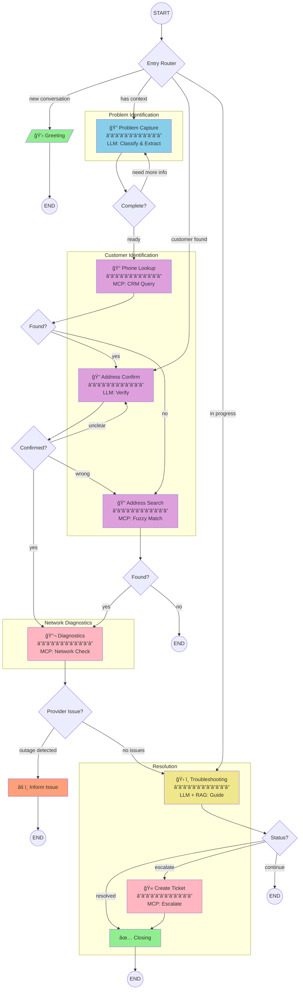

# ISP Customer Service Chatbot

An intelligent conversational agent designed to automate customer support operations for Internet Service Providers. Built with LangGraph workflow orchestration, the system handles the complete customer service lifecycle — from initial problem identification through guided troubleshooting to ticket escalation.

## Project Overview

This solution addresses a critical challenge in ISP customer support: providing consistent, efficient, and intelligent first-line assistance without human intervention. The agent leverages a state-machine architecture powered by LangGraph to navigate complex support scenarios while maintaining natural conversation flow.

The system integrates three core AI capabilities:
- **LLM-powered conversation understanding** (Claude) for natural language processing and decision-making
- **RAG-based knowledge retrieval** for context-aware troubleshooting guidance  
- **MCP tool integration** for real-time CRM and network diagnostics access

Supporting both Lithuanian and English languages, the agent serves as a complete customer service solution capable of resolving common issues autonomously or escalating complex cases with full context preservation.

---

## Key Capabilities

| Capability | Description |
|------------|-------------|
| **Intelligent Problem Classification** | Automatically categorizes issues (internet, TV, phone, billing) with context extraction |
| **Customer Identification** | Phone-based lookup with address verification and fuzzy matching |
| **Automated Network Diagnostics** | Real-time checks for area outages, port status, and IP assignment |
| **Guided Troubleshooting** | Step-by-step resolution with smart scenario selection based on problem context |
| **Context-Aware Routing** | Skips redundant steps based on information customer already provided |
| **Automatic Ticket Creation** | Seamless escalation with full troubleshooting history |
| **Bilingual Support** | Native Lithuanian and English conversation handling |

---

## Agent Workflow

The agent operates through a directed graph of specialized nodes, each responsible for a specific phase of the customer service process.

### Workflow Graph



### Node Reference

| Node | Purpose | Technology |
|------|---------|------------|
| `greeting` | Welcome message display | Static config |
| `problem_capture` | Problem classification and context extraction | LLM (Claude) |
| `phone_lookup` | Customer identification by phone | MCP → CRM |
| `address_confirmation` | Service address verification | LLM (Claude) |
| `address_search` | Fuzzy address matching | MCP → CRM |
| `diagnostics` | Network status verification | MCP → Network |
| `inform_provider_issue` | Outage notification | Static message |
| `troubleshooting` | Guided step-by-step resolution | LLM + RAG |
| `create_ticket` | Support ticket generation | MCP → CRM |
| `closing` | Conversation summary and farewell | Static message |

→ *Detailed workflow documentation: [docs/WORKFLOW.md](docs/WORKFLOW.md)*

---

## Conversation Flow Example

A typical customer interaction demonstrating the agent's problem-solving approach:

```
┌─────────────────────────────────────────────────────────────────────────────â”
│  CUSTOMER JOURNEY: Internet Connection Issue                                │
├─────────────────────────────────────────────────────────────────────────────┤
│                                                                             │
│  👤 Customer: "Labas, man neveikia internetas"                             │
│              (Hello, my internet is not working)                            │
│                                                                             │
│  ┌─────────────────────────────────────────────────────────────────────┠  │
│  │ 🔠PROBLEM CAPTURE                                                   │   │
│  │    • Detected: internet problem                                      │   │
│  │    • Context needed: duration, scope, restart attempted              │   │
│  └─────────────────────────────────────────────────────────────────────┘   │
│                                                                             │
│  🤖 Agent: "Suprantu, turite interneto problemą.                           │
│            Ar problema visuose įrenginiuose?"                               │
│            (I understand you have an internet problem.                      │
│             Is the problem on all devices?)                                 │
│                                                                             │
│  👤 Customer: "Taip, niekur neveikia nuo vakar"                            │
│              (Yes, not working anywhere since yesterday)                    │
│                                                                             │
│  ┌─────────────────────────────────────────────────────────────────────┠  │
│  │ 📠PHONE LOOKUP → 📠ADDRESS CONFIRMATION                            │   │
│  │    • Customer found: Jonas Jonaitis                                  │   │
│  │    • Address: Tilžės g. 12-5, Šiauliai ✓                            │   │
│  └─────────────────────────────────────────────────────────────────────┘   │
│                                                                             │
│  ┌─────────────────────────────────────────────────────────────────────┠  │
│  │ 🔬 DIAGNOSTICS                                                       │   │
│  │    • Area outages: None                                              │   │
│  │    • Port status: UP                                                 │   │
│  │    • IP assignment: Active                                           │   │
│  │    → Proceed to troubleshooting                                      │   │
│  └─────────────────────────────────────────────────────────────────────┘   │
│                                                                             │
│  ┌─────────────────────────────────────────────────────────────────────┠  │
│  │ ğŸ› ï¸ TROUBLESHOOTING (Scenario: internet_no_connection)               │   │
│  │    • Smart routing: Customer mentioned "all devices"                 │   │
│  │    • Selected starting point: Router check                           │   │
│  └─────────────────────────────────────────────────────────────────────┘   │
│                                                                             │
│  🤖 Agent: "Patikrinkite maršrutizatoriaus lemputes.                       │
│            Kokios spalvos jos Å¡vieÄia?"                                     │
│            (Check your router lights. What color are they?)                 │
│                                                                             │
│  👤 Customer: "Visos žalios"                                               │
│              (All green)                                                    │
│                                                                             │
│  🤖 Agent: "Pabandykime perkrauti maršrutizatorių.                         │
│            Išjunkite jį 30 sekundžių ir vėl įjunkite."                     │
│                                                                             │
│  👤 Customer: "Perkroviau, dabar veikia!"                                  │
│              (Restarted, now it works!)                                     │
│                                                                             │
│  ┌─────────────────────────────────────────────────────────────────────┠  │
│  │ ✅ RESOLUTION DETECTED                                               │   │
│  │    • Problem resolved: Yes (user confirmed)                          │   │
│  │    • Escalation needed: No                                           │   │
│  └─────────────────────────────────────────────────────────────────────┘   │
│                                                                             │
│  🤖 Agent: "Puiku! Džiaugiuosi, kad pavyko išspręsti problemą.             │
│            Ar galiu dar kuo nors padėti?"                                  │
│                                                                             │
└─────────────────────────────────────────────────────────────────────────────┘
```

---

## What Makes It Smart

### 1. LangGraph Workflow Engine

The agent uses LangGraph's state machine architecture for deterministic conversation flow with intelligent routing decisions.

```
┌─────────────┠    ┌─────────────┠    ┌─────────────â”
│   State     │────▶│    Node     │────▶│   Router    │
│  (Pydantic) │     │  (Action)   │     │ (Decision)  │
└─────────────┘     └─────────────┘     └──────┬──────┘
                                               │
                    ┌──────────────────────────┼──────────────────────────â”
                    â–¼                          â–¼                          â–¼
              [Next Node A]              [Next Node B]              [END]
```

**Key Features:**
- Pydantic-based state validation
- Conditional routing based on conversation context  
- Memory persistence across conversation turns
- Error recovery with graceful fallbacks

→ *Details: [docs/WORKFLOW.md](docs/WORKFLOW.md)*

---

### 2. MCP Tools Integration

Model Context Protocol (MCP) enables standardized communication with external services.

| Tool | Server | Purpose |
|------|--------|---------|
| `lookup_customer_by_phone` | CRM Service | Find customer by phone number |
| `lookup_customer_by_address` | CRM Service | Fuzzy address matching |
| `get_customer_details` | CRM Service | Retrieve services & equipment |
| `create_ticket` | CRM Service | Generate support tickets |
| `check_area_outages` | Network Service | Detect regional issues |
| `check_port_status` | Network Service | Verify connection status |

```
┌──────────────┠     JSON-RPC       ┌──────────────┠     SQL      ┌──────────â”
│  Workflow    │◄───────────────────►│  MCP Server  │◄─────────────►│  SQLite  │
│    Node      │                     │  (CRM/Net)   │               │    DB    │
└──────────────┘                     └──────────────┘               └──────────┘
```

→ *Details: [docs/MCP_TOOLS.md](docs/MCP_TOOLS.md)*

---

### 3. RAG Knowledge System

Retrieval-Augmented Generation provides context-aware troubleshooting guidance.

```
┌─────────────────────────────────────────────────────────────────â”
│                      RAG Pipeline                                │
├─────────────────────────────────────────────────────────────────┤
│                                                                  │
│   Query: "internet connection drops"                            │
│                     │                                            │
│                     ▼                                            │
│   ┌─────────────────────────────────┠                          │
│   │      Embedding Manager          │                           │
│   │   (paraphrase-multilingual)     │                           │
│   └────────────────┬────────────────┘                           │
│                    │                                             │
│          ┌─────────┴─────────┠                                 │
│          ▼                   ▼                                   │
│   ┌─────────────┠   ┌──────────────┠                          │
│   │  Semantic   │    │   Keyword    │                           │
│   │   Search    │    │   Matching   │                           │
│   │   (FAISS)   │    │  (Technical) │                           │
│   │    70%      │    │     30%      │                           │
│   └──────┬──────┘    └──────┬───────┘                           │
│          │                  │                                    │
│          └────────┬─────────┘                                    │
│                   ▼                                              │
│   ┌─────────────────────────────────┠                          │
│   │     Hybrid Re-ranking           │                           │
│   │   + Scenario Selection          │                           │
│   └─────────────────────────────────┘                           │
│                                                                  │
└─────────────────────────────────────────────────────────────────┘
```

**Capabilities:**
- Hybrid search combining semantic similarity and keyword matching
- Multilingual embeddings (768 dimensions)
- YAML-based troubleshooting scenarios
- Smart routing based on problem context

→ *Details: [docs/RAG_SYSTEM.md](docs/RAG_SYSTEM.md)*

---

### 4. Intelligent Troubleshooting

The system selects optimal troubleshooting scenarios and adapts to customer context.

**Smart Routing Logic:**
```
Problem Context Analysis
         │
         ├─── Single device affected? ──────► internet_single_device
         │
         ├─── Connection intermittent? ─────► internet_intermittent  
         │
         ├─── Slow speed reported? ─────────► internet_slow
         │
         └─── Default ──────────────────────► internet_no_connection
```

**Adaptive Features:**
- Skips steps customer already tried (based on problem_context)
- Detects help requests and provides detailed explanations
- Recognizes resolution confirmation (explicit and implicit)
- Escalates appropriately with full context preservation

→ *Details: [docs/TROUBLESHOOTING_SCENARIOS.md](docs/TROUBLESHOOTING_SCENARIOS.md)*

---

## Architecture Overview

```
┌─────────────────────────────────────────────────────────────────────────────â”
│                         ISP Customer Service Bot                             │
├─────────────────────────────────────────────────────────────────────────────┤
│                                                                              │
│   ┌────────────────────────────────────────────────────────────────────┠   │
│   │                        Interface Layer                              │    │
│   │  ┌──────────────┠  ┌──────────────┠  ┌──────────────┠           │    │
│   │  │  Streamlit   │   │   CLI Chat   │   │   REST API   │            │    │
│   │  │   Demo UI    │   │  Interface   │   │   (Future)   │            │    │
│   │  └──────────────┘   └──────────────┘   └──────────────┘            │    │
│   └────────────────────────────────────────────────────────────────────┘    │
│                                      │                                       │
│   ┌────────────────────────────────────────────────────────────────────┠   │
│   │                        Core Engine                                  │    │
│   │                                                                     │    │
│   │   ┌─────────────────────────────────────────────────────────┠     │    │
│   │   │              LangGraph Workflow Engine                   │      │    │
│   │   │         (State Machine + Conditional Routing)            │      │    │
│   │   └─────────────────────────────────────────────────────────┘      │    │
│   │                              │                                      │    │
│   │          ┌───────────────────┼───────────────────┠                │    │
│   │          ▼                   ▼                   ▼                 │    │
│   │   ┌────────────┠    ┌─────────────┠    ┌────────────┠          │    │
│   │   │    LLM     │     │     MCP     │     │    RAG     │           │    │
│   │   │  Service   │     │   Clients   │     │  System    │           │    │
│   │   │  (Claude)  │     │             │     │  (FAISS)   │           │    │
│   │   └────────────┘     └──────┬──────┘     └────────────┘           │    │
│   │                             │                                      │    │
│   └─────────────────────────────│──────────────────────────────────────┘    │
│                                 │                                            │
│   ┌─────────────────────────────│──────────────────────────────────────┠   │
│   │                        External Services                            │    │
│   │                             │                                       │    │
│   │          ┌──────────────────┼──────────────────┠                  │    │
│   │          ▼                                     ▼                   │    │
│   │   ┌─────────────┠                     ┌─────────────┠            │    │
│   │   │ CRM Service │                      │  Network    │             │    │
│   │   │ MCP Server  │                      │  Diagnostics│             │    │
│   │   └──────┬──────┘                      └──────┬──────┘             │    │
│   │          │                                    │                    │    │
│   │          └────────────────┬───────────────────┘                    │    │
│   │                           ▼                                        │    │
│   │                    ┌─────────────┠                                │    │
│   │                    │   SQLite    │                                 │    │
│   │                    │  Database   │                                 │    │
│   │                    └─────────────┘                                 │    │
│   └────────────────────────────────────────────────────────────────────┘    │
│                                                                              │
└─────────────────────────────────────────────────────────────────────────────┘
```

→ *Details: [docs/ARCHITECTURE.md](docs/ARCHITECTURE.md)*

---

## Technology Stack

| Category | Technology | Purpose |
|----------|------------|---------|
| **Orchestration** | LangGraph | Workflow state machine |
| **Language Model** | Claude 3.5 Sonnet | Natural language understanding |
| **Embeddings** | sentence-transformers | Multilingual text embeddings |
| **Vector Store** | FAISS | Similarity search |
| **Tool Protocol** | MCP (Model Context Protocol) | External service integration |
| **Database** | SQLite | Customer and ticket data |
| **State Management** | Pydantic | Type-safe state validation |
| **Configuration** | YAML | Scenarios and translations |
| **UI** | Streamlit | Demo interface |
| **Language** | Python 3.11+ | Primary development language |

---

## Quick Start

```bash
# 1. Clone repository
git clone https://github.com/your-org/isp-chatbot.git
cd isp-chatbot

# 2. Create virtual environment
python -m venv venv
source venv/bin/activate  # Windows: venv\Scripts\activate

# 3. Install dependencies
pip install -e ".[dev]"

# 4. Initialize database
python scripts/init_database.py

# 5. Start MCP servers (separate terminal)
python -m crm_service.src.crm_mcp.server

# 6. Run chatbot
streamlit run chatbot_core/src/streamlit_ui/app.py
```

→ *Full installation guide: [docs/INSTALLATION.md](docs/INSTALLATION.md)*

---

## Project Structure

```
isp-customer-service/
│
├── chatbot_core/                   # Main application
│   └── src/
│       ├── graph/                  # LangGraph workflow
│       │   ├── graph.py            # Graph definition
│       │   ├── state.py            # Pydantic state model
│       │   └── nodes/              # Individual nodes
│       │
│       ├── rag/                    # Knowledge retrieval
│       │   ├── retriever.py        # Hybrid retriever
│       │   ├── embeddings.py       # Embedding manager
│       │   ├── vector_store.py     # FAISS wrapper
│       │   └── scenario_loader.py  # YAML scenarios
│       │
│       ├── services/               # External integrations
│       │   ├── llm.py              # Claude API wrapper
│       │   └── mcp_service.py      # MCP client
│       │
│       ├── config/                 # Configuration files
│       │   ├── config.yaml
│       │   ├── messages.yaml
│       │   └── problem_types.yaml
│       │
│       └── streamlit_ui/           # Demo interface
│
├── crm_service/                    # CRM MCP server
│   └── src/crm_mcp/
│       ├── server.py
│       └── tools/
│
├── knowledge_base/                 # RAG content
│   └── troubleshooting/
│       └── scenarios/
│
├── database/                       # SQLite database
│
└── docs/                           # Documentation
```

---

## Documentation

| Document | Description |
|----------|-------------|
| [ARCHITECTURE.md](docs/ARCHITECTURE.md) | System architecture and design decisions |
| [WORKFLOW.md](docs/WORKFLOW.md) | LangGraph nodes and routing logic |
| [STATE.md](docs/STATE.md) | Pydantic state model reference |
| [MCP_TOOLS.md](docs/MCP_TOOLS.md) | MCP servers and tool specifications |
| [RAG_SYSTEM.md](docs/RAG_SYSTEM.md) | Knowledge retrieval pipeline |
| [TROUBLESHOOTING_SCENARIOS.md](docs/TROUBLESHOOTING_SCENARIOS.md) | Scenario format and creation guide |
| [INTERNATIONALIZATION.md](docs/INTERNATIONALIZATION.md) | Multi-language support |
| [UI.md](docs/UI.md) | Streamlit interface components |
| [CONFIGURATION.md](docs/CONFIGURATION.md) | YAML configuration reference |
| [INSTALLATION.md](docs/INSTALLATION.md) | Setup and deployment guide |
| [API_REFERENCE.md](docs/API_REFERENCE.md) | Programmatic API documentation |

---

## License

[License information]

---

*Built with LangGraph, Claude, and MCP*
