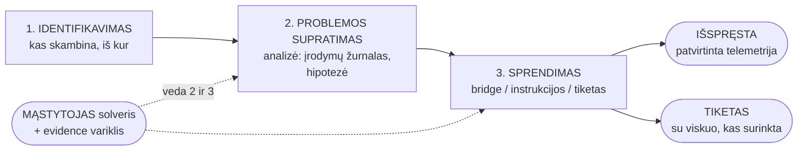
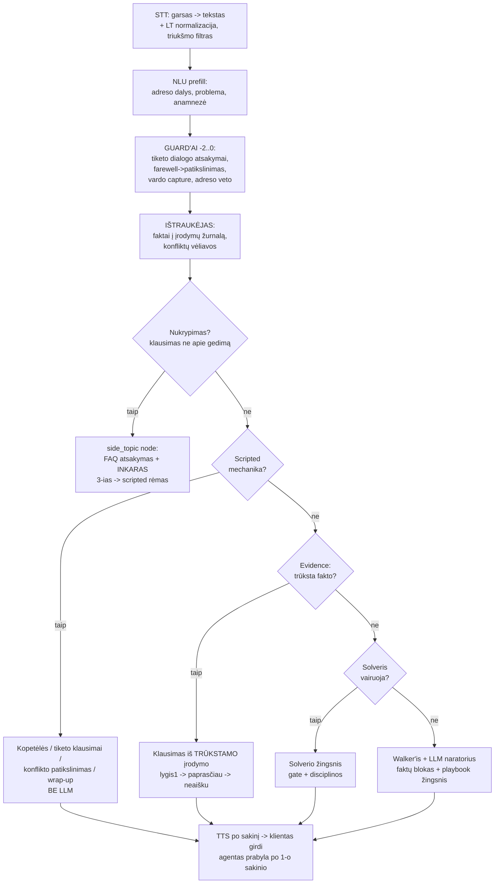
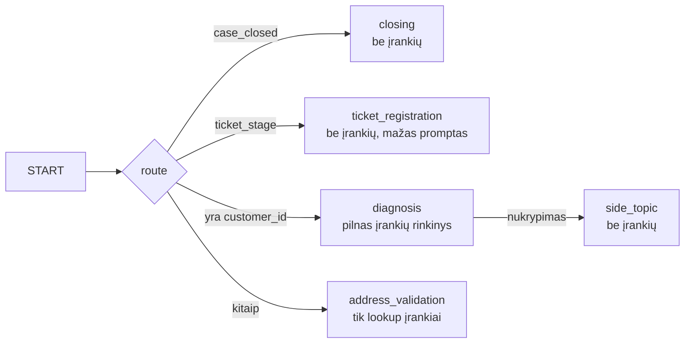
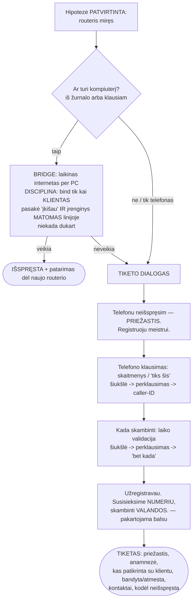

# AGENTO FLOW — kaip agentas dirba, mąsto ir sprendžia

*Peržiūros dokumentas (2026-08-07). Tikslas: matyti visą algoritmą vienoje
vietoje, rasti spragas ir spręsti, ką tobulinti.*

---

## 1. Didysis paveikslas: trys blokai + mąstytojas



Kertinis principas — **atsakomybių padalijimas**:

| Kas | Savininkas | Kodėl |
|---|---|---|
| KADA ir KĄ klausti, perėjimai, commit'ai, registracija | **VARIKLIS** (deterministinis) | mechanika negali „nuklysti" |
| KAIP suformuluoti žmoniškai, atsakyti į laisvus klausimus | **LLM** (mažas node promptas + faktai) | natūralumas, adaptacija prie kliento |
| Faktų šaltinis | telemetrija > kliento žodžiai | žodžiai niekada neperrašo įrankių tiesos |

Pozicija pokalbyje = **KAS JAU ŽINOMA** (įrodymų žurnalas), ne žingsnio numeris —
todėl pertraukimai, nukrypimai ar solverio nusodinimas niekada „neatsuka" pokalbio.

---

## 2. Vieno turn'o konvejeris (kas įvyksta per VIENĄ kliento repliką)



Svarbu: **kiekvienas sluoksnis gali perimti turn'ą; žemesni nebevykdomi.**
Politikos turn'ai (atsisveikinimas, atsisakymas) VISADA nusileidžia iki
guard'ų — mąstytojas jų neliečia.

---

## 3. Grafo node'ai ir maršrutas



Įrankių ribojimas — **struktūrinis** saugiklis: identifikacijos node'as fiziškai
neturi `diagnose/update_mac/create_ticket`, tad „diagnozė prieš identifikaciją"
neįmanoma iš konstrukcijos.

---

## 4. IDENTIFIKAVIMO kopetėlės (visos frazės — `identification.yaml`)

```mermaid
flowchart TD
    P0[Pasisveikinimas] --> P1{Klientas pasakė<br/>problemą?}
    P1 -- "small-talk (Labadiena!)" --> P1a[scripted: Kuo galiu padėti?] --> P1
    P1 -- taip --> AN[ANAMNEZĖ: kada dingo, po ko?<br/>atsakymas -> žurnalas]
    AN --> OF{Yra kandidatas<br/>pagal caller-ID?}
    OF -- taip --> OFQ[Pasiūlymas: ar skambinate dėl X?]
    OF -- ne --> ASK[Paprašom adreso diktavimu]
    OFQ -- švarus TAIP --> COMMIT
    OFQ -- ne/garble --> ASK
    ASK --> COMMIT[VARIKLIS commit'ina identitetą<br/>+ TYLIAI resolve + diagnose]
    COMMIT --> CUE["Supratau — adresas. TUOJ PATIKRINSIU RYŠĮ.<br/>O su kuo kalbu?"]
    CUE --> NAME[Vardas+ryšys — TIK ĮRAŠUI, ne vartai<br/>('Taip.' nėra vardas)]
    NAME --> RES[VIENA replika: paskelbimas + REALUS rezultatas<br/>arc v3 — jokių tuščių 'patikrinsiu']
```

Apsaugos: adreso commit'as tik iš ŠVARAUS taip; klientas gali pataisyti adresą
(reopen); „po audros" ≠ „Aušros g."; buto numeris niekada neimamas iš DB.

## 5. SUPRATIMAS — įrodymų žurnalas ir hipotezė

Gedimas aprašytas ŽINIOMIS (`faults.yaml`): ko reikia, kaip klausti, kada
patvirtinta/paneigta, koks sprendimas.

```mermaid
flowchart TD
    V[Telemetrijos verdiktas<br/>pvz. B6: įrenginio nematome] --> H[HIPOTEZĖ: routeris miręs<br/>statusas: testing]
    H --> Q[Klausiam pirmo TRŪKSTAMO įrodymo:<br/>rado dėžutę? -> lemputės? -> laidas? -> rozetė?]
    Q -- atsakymas --> X[IŠTRAUKĖJAS -> žurnalas<br/>+ išvedimai: kalba apie lemputes<br/>=> stovi prie routerio]
    X -- prieštarauja --> K[VIENAS scripted patikslinimas:<br/>„sakėte X, dabar Y — kaip yra?"]
    X --> ST{Žurnalo būsena}
    ST -- paneigta: lemputės DEGA --> PIV[Pivot į kabelio kelią<br/>walker'is sinchronizuotas, NE iš pradžių]
    ST -- patvirtinta --> SOL[-> SPRENDIMO blokas]
    ST -- trūksta --> Q
```

Žurnalo taisyklės: telemetrija perrašo (istorija lieka); žodžiai telemetrijos
NEperrašo; kliento prieštaravimas — vėliava + patikslinimas; „neaišku" po dviejų
nesuprastų klausimų — judam toliau, jokių kilpų.

## 6. SPRENDIMAS — vienpusės durys



Atgal kelio nėra: patvirtinus hipotezę klausimai grįžti prie lempučių
nebegeneruojami (nebėra trūkstamų įrodymų, iš kurių jie kiltų).

## 7. NUKRYPIMAI ir PERTRAUKIMAI

**Trys pertraukimo tipai — vienas mechanizmas:**

| Klientas | Elgesys |
|---|---|
| pertraukia su ATSAKYMU („taip taip, Vilniaus 29") | užsiskaito, seka tęsiasi |
| pertraukia su KLAUSIMU („kiek kainuos?") | side_topic: FAQ atsakymas + INKARAS („grįžkime — ar dega lemputės?") |
| pertraukia su niekuo (oras, politika) | „ne mano sritis" + INKARAS; 3-ias iš eilės — scripted rėmas, o jei hipotezė patvirtinta: „sprendžiam kartu ar registruoju meistrą?" |

**Barge-in techniškai:** „aha/taip" (trumpas) — agentas kalba toliau; tikra
kalba — garsas stop < 0.5 s, LLM generacija NUTRAUKIAMA, į istoriją įrašoma tik
išgirsta dalis („…—"), `asked` atsukama → nutrauktas klausimas PERKLAUSIAMAS.
Pertraukianti frazė tampa naujo atsakymo pradžia — žodžiai nedingsta.

**Politikos (guard'ai — mąstytojas jų nekeičia):**
- „viso gero" vidury proceso → VIENAS patikslinimas „ar tikrai baigti?" → per registraciją
- „nedarysiu / neturiu laiko / ne namuose" → registracijos pasiūlymas (2026-07-30)
- ragelis padėtas vidury → ŠVIEŽIA telemetrijos patikra: gedimas liko → tiketas
  automatiškai; linija sveika → jokio tiketo (2026-08-06)
- „užregistravau" žodis be tikro tiketo → variklis TĄ AKIMIRKĄ pradeda tikrą dialogą

---

## 8. PAVYZDYS: „neveikia internetas" — kas vyksta viduje

| # | Girdisi | Agento viduje |
|---|---|---|
| 1 | A: „Labas! Kuo galiu padėti?" | scripted pasisveikinimas; TYLIAI: caller-ID → kandidatas + masinės avarijos patikra |
| 2 | K: „Neveikia internetas" | NLU: problema=internet_down → **kopetėlės startuoja** |
| 3 | A: „O kada pastebėjote — po ko?" | scripted ANAMNEZĖ (žinios būsimam tiketui) |
| 4 | K: „Vakar, po audros" | anamnezė → žurnalas (when/trigger) |
| 5 | A: „Ar skambinate dėl Vilniaus g. 29?" | scripted pasiūlymas iš kandidato |
| 6 | K: „Taip" | ŠVARUS taip → VARIKLIS commit + TYLIAI resolve+diagnose → verdiktas B6 → hipotezė „routeris miręs" |
| 7 | A: „Supratau — adresas. Tuoj patikrinsiu ryšį. Su kuo kalbu?" | scripted echo+cue+vardo klausimas (rezultatas jau kišenėje) |
| 8 | K: „Andrius, sutartį sudaręs" | vardas („Andrius", ne sakinys) + ryšys → įrašui |
| 9 | A: „Patikrinau: internetas ateina, bet įrenginio nematome. Dažniausiai tai routeris... Ar patogu patikrinti kartu?" | LLM paskelbimas iš REZULTATO faktų (arc v3) |
| 10 | K: „O kiek man tai kainuos?" | **side_topic**: variklis užšaldytas |
| 11 | A: „Telefonu nieko nekainuoja... Grįžkime — ar patogu patikrinti?" | FAQ + inkaras |
| 12 | K: „Gerai, galim" | evidence: trūksta device_present → klausiam |
| 13 | A: „Susiraskite routerį — dėžutę..." | evidence klausimas lygis 1 |
| 14 | K: „Radau, bet nedega nė viena lemputė" | ištraukėjas: device=rado + lights=nedega (dvigubas faktas vienu ypu) |
| 15 | A: „Patikrinkite maitinimo laidą..." | kitas trūkstamas: power_cable |
| 16 | K: „Įkištas, kitą rozetę bandžiau" | power=įkištas, outlet=bandyta → **HIPOTEZĖ PATVIRTINTA** |
| 17 | A: „Panašu, routeris sugedęs. Ar turite kompiuterį — paleisčiau laikinai?" | sprendimų fazė: has_computer klausimas |
| 18a | K: „Turiu" → bridge kelias | solveris veda; bind TIK po „įkišau" + įrenginys matomas |
| 18b | K: „Neturiu, tik telefoną" | **deterministinė eskalacija** → tiketo dialogas (žr. §6) |

## 9. Kur KLIENTO pasirinkimas, kur AGENTO mąstymas

**Klientas renkasi:** ar tikrinti dabar / vėliau / registruoti; bridge ar
meistras; kokiu numeriu ir kada skambinti; ar baigti pokalbį (su patikslinimu).

**Agentas mąsto (LLM):** kaip suformuluoti pagal klientą; atsakymai į laisvus
klausimus (FAQ ribose); solverio žingsnio parinkimas bridge fazėje (gate
prižiūri).

**Agentas NEmąsto — vykdo (variklis):** identiteto commit, diagnozė, hipotezės
statusas iš žurnalo, bind sąlygos, registracija, uždarymo keliai, politikos.

---

## 10. ŽINOMOS RIBOS ir atviri klausimai (kandidatai tobulinimui)

1. **Findings santraukos node dar nėra** — paskelbimą formuluoja LLM iš faktų;
   08-06 skambutyje maišė B6/foreign_mac žinias. Planas: findings node iš
   žurnalo (šlifavimo backlog #1).
2. **Ištraukėjas — keyword v1** — darkyta STT dalis faktų praslysta (perklausimų
   daugiau nei galėtų būti). Planas: LLM ištraukėjas + klasifikatorių
   konsolidacija (#2).
3. **Evidence aprašytas tik no_mac_observed** — kiti gedimai (foreign_mac,
   client_side, crc...) tebeveikia senuoju walker/solver keliu be žurnalo
   disciplinos (#3).
4. **Neaiškios priežasties gedimai** — atskiros šakos nėra; dabar baigtųsi
   sąžiningu tiketu, bet be specialaus „nežinomo gedimo" klausimyno.
5. **LLM turn'ų latency 4.5–7.5 s** (TTFT dominuoja) — prompt dieta / async.
6. **Scripted turn'ų kliento frazės nepatenka į LLM istoriją** (kortelė kabo) —
   naratorius mato ne visą pokalbį.
7. **FAQ mažas** — pildyti temomis iš realių skambučių.
8. **Klausimo detekcija be klaustuko** remiasi žodynu — reti formulavimai
   („įdomu, kiek moku") gali praslysti pro side_topic.

---

*Susiję: ROADMAP.md (fazės), BARGE_IN_TESTAI.md (balso testų scenarijai),
faults.yaml (gedimų žinios), identification.yaml (frazės), faq.yaml (žinomi
atsakymai).*
