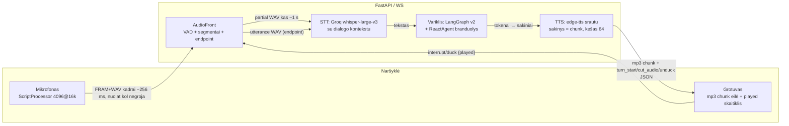
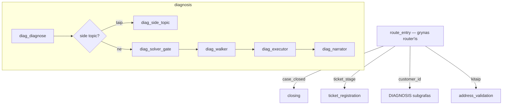

# Agento architektūra ir pipeline (būsena 2026-08-26)

Dokumentas atsako į penkis architektūrinės peržiūros klausimus: bendras srautas,
būsenos schema, sprendimų medžiai + RAG, įrankiai, eskalacija. Gale — žinomi
butelio kakleliai ir suplanuoti sprendimai.

Vedantysis principas visame projekte: **kodas = mechanika, failai = elgsena,
LLM = balsas.** Deterministinės mašinos (walker, ledger, vartai) valdo eigą;
YAML/MD failai aprašo, KĄ agentas žino ir ko siekia; LLM tik įžodina tikslus.

---

## 1. Bendras duomenų ir srautų pipeline

### 1.1 Garso ir teksto kelias (protokolai)

Vienas WebSocket per skambutį (`/ws/call/{id}`) — juo teka VISKAS: garsas
aukštyn, garsas žemyn, valdymo JSON žinutės ir gyvi trace įvykiai (dešinės
panelės „smegenys“). Jokio WebRTC — naršyklės klientas yra „kvailas
mikrofonas ir garsiakalbis“ (DUPLEX=on režimu), visas intelektas serveryje.



Srauto etapai (visi gyvi, jungikliai config puslapyje):

| Etapas | Mechanizmas |
|---|---|
| Garsas aukštyn | Klientas siunčia PCM kadrus **nuolat** (kol agentas negroja) — `"FRAM"`+WAV, ~256 ms/kadras. Kliento VAD liko tik VU juostelei ir barge režimui. |
| Kirpimas (endpointing) | **Serverio** `AudioFront` (grynas automatas, laikas iš sample'ų): energijos VAD (`SERVER_VAD_THR`), segmentas su pre-roll, tylos langas semantinis — E2 užuomina iš partial'o: nebaigta mintis (jungtukas/kablelis gale) → 1400 ms, pilnas laukiamas atsakymas → 350 ms, kita → 900 ms. |
| Daliniai transkriptai | Kalbant kas ~1 s segmento kopija → Whisper su dialogo kontekstu (paskutinis klausimas + laukiamų atsakymų žodynas biasina dekodavimą). Rodomi kliento UI gyvai; maitina endpoint užuominą ir ASR head-start. |
| ASR head-start (D4) | Jei po paskutinio partial'o buvo tik tyla — galutinė transkripcija **perpanaudojama** iš partial'o, ASR ratas praleidžiamas (~0.5–0.7 s). |
| LLM | LangGraph v2 grafas; naratoriaus turn'as streamina tokenus → sakinių ribose iškart TTS. Spekuliacija (S1) numatytiems atsakymams paruošia atsakymą iš anksto — LLM+TTS praleidžiami. |
| Garsas žemyn | mp3 chunk = 1 sakinys; klientas groja eilėje ir skaičiuoja **pilnai sugrotus** (D1 pristatymo žurnalui). Kartotinės frazės — iš TTS kešo (20–50 ms). |
| Kalba, kol turn'as sukasi | Kadrai NE metami — segmentas kaupiamas (stash) ir tampa kitu turn'u iškart. |
| Backchannel | Ilgas kliento pasakojimas (>4 s) → vienas „Mhm“/„Aha, klausau“ ŠALIA grojimo eilės (mic nenutrūksta, barge nekyla). |
| Tylos check-in | 35 s tylos prie stovinčios užduoties → serveris pats sako „Kaip sekasi — ar pavyksta?“. |

### 1.2 Vėlinimo biudžetas (išmatuota iš gyvų trace'ų)

Nuo kliento kalbos pabaigos iki pirmo TTS garso (TTFA):

| Komponentas | Trukmė |
|---|---|
| Tylos langas (endpoint) | 350 ms (fast) / 900 ms (normal) / 1400 ms (slow) |
| ASR (Groq whisper, pilna frazė) | 400–700 ms; **0 ms** kai suveikia head-start |
| Variklis + LLM (gpt-4o-mini naratorius) | 1–6 s tipinis; 8–11 s pikai ilgose instrukcijose |
| TTS pirmas sakinys (edge-tts) | 500–1000 ms; 20–50 ms iš kešo |
| **Viso — tipiniai keliai** | **normal LLM: 1.5–4 s · scripted: 0.5–1.4 s · spekuliacijos hit: 0.5–0.8 s · kešuota frazė: <0.5 s** |

Istorija: prieš duplekso bangą buvo 2.5–9 s. Didžiausias likęs rezervas — LLM
mąstymo laikas (žr. §6, P5 LLM pre-startas).

### 1.3 Pertraukimo (barge-in) logika — „duck-then-decide“

Klientui prabilus agentui dar kalbant, garsas NE kertamas aklai:

```mermaid
sequenceDiagram
  participant K as Klientas
  participant S as Serveris
  K->>K: kalba virš agento ≥ slenkstis
  K->>K: DUCK — agento garsas → 25%
  K->>S: {"duck", played: N} + kalbos kadrai
  S->>S: partial ASR ant pritildyto segmento
  alt aidas / „mhm“ (fuzzy prieš ką tik sakytą tekstą)
    S->>K: {"unduck"} — garsas grįžta, segmentas išmetamas
  else tikra kalba (default-deny → substantive/stop)
    S->>K: {"cut_audio"} — stop
    S->>S: D1: istorijoje lieka tik N sugrotų sakinių;<br/>nepasakyta uodega → PERTRAUKTA nota kitam turn'ui
    S->>S: segmentas tampa nauju turn'u
  end
```

Esminiai saugikliai: (a) klaidingo aido kaina — tik ~0.5 s pritildymo, ne
nukirstas sakinys; (b) **pristatymo žurnalas** — variklis žino, ką klientas
REALIAI išgirdo (pusiau sugrotas sakinys = negirdėtas), ir kitame turn'e
naratorius esminę negirdėtą dalį pasako savais žodžiais; (c) kliento 2.5 s
auto-unduck, jei serveris neatsako.

---

## 2. LangGraph būsenos struktūra

### 2.1 Grafas



`AGENT_ENGINE=v2` (numatytasis; `graph`/`legacy` — rollback). Checkpointeris —
`SqliteSaver` (`thread_id = session_id`), pilna būsena išgyvena restartą,
`get_state_history()` duoda time-travel per turn'us.

### 2.2 Būsenos laukai (AgentState ↔ GraphState, sinchronizuojama kas turn'ą)

| Grupė | Laukai |
|---|---|
| Identifikacija | `caller_phone`, `customer_id`, `customer_name` (SUTARTIES savininkas — kreipiniui nenaudojamas), `customer_address`, `caller_name`/`caller_relation` (kaip prisistatė), `phone_candidate`, `profile` (girdėti adreso slotai su confidence), `address_confirmed`, `preflight_outage` |
| Problema / anamnezė | `problem_type`, `problem_description`, `secondary_problems` (antrinės — tik į tiketą), `anamnesis_raw/when/trigger`, `symptoms` |
| Diagnostika | `diagnosis` (telemetrijos verdiktai pagal domeną), `hypothesis` {cause, status, settled_by}, `rejected_hypotheses` (istorija — netikrinama pakartotinai), `evidence` — **faktų žurnalas** (žr. §3), `observations` |
| Eiga | `resolution` {verdict, step, asked, presented, journal…} — aktyvaus gedimo medžio VIRŠŪNĖ ir žingsnių žurnalas, `awaiting`/`awaiting_turns` (ko laukiam iš kliento), `last_question`, `last_intent`, `stuck_count`, `clarity_level` |
| Tiketas / pabaiga | `ticket_id`, `ticket_stage` (phone→hours→done), `contact_phone/hours`, `case_closed`, `closed_reason`, `is_complete`, `closing_turns` |
| Pokalbis | `messages` (pilna istorija — po pertraukimo NUKERPAMA iki girdėtos dalies), `turn_count`, `heard_utterances` |

Šalia state gyvena variklio vienkartinės notos (per-turn direktyvos,
`_undelivered_tail`, `_analyst_notes`, `_fact_confirm`…) — jos sudega į
naratoriaus KNOWN FACTS bloką ir išsivalo.

### 2.3 Fono darbai ir būsenos atnaujinimo taisyklės

Kol klientas atsakinėja/dirba, fone (atskiras thread'as, pokalbio nestabdo)
sukasi trys skaitytojai. **Taisyklė: fonas NIEKADA nerašo būsenos tiesiogiai
ir nekviečia mutuojančių įrankių** — rezultatai įsiuvami TIK deterministinio
turn'o pradžioje, pro vartus:

| Fono darbas | Ką daro | Įsiuvimo vartai |
|---|---|---|
| Spekuliacija (S1) | Kiekvienam numatytam atsakymui į atvirą klausimą ant žurnalo KOPIJOS suskaičiuoja kitą direktyvą, LLM'u paruošia tekstą ir TTS audio | Panaudojama tik jei atsakymas deterministiškai map'inasi į šaką, be papildomų faktų; kitaip — normalus kelias byte-for-byte |
| Fono diagnostika (S2) | READ-ONLY `diagnose_connection` atnaujinimas | Įsiuvama tik jei verdiktas NEpasikeitė ir ne sprendimo/tilto fazėje — kitaip discard (naratyvo apvertimo sargas) |
| Tylusis analitikas (W2) | Perskaito VISĄ pokalbį + žurnalą, iki 2 patariamųjų pastabų („jau sakė X — nebeklausk“, „faktas įtartinas — patikslink“) | Tik formuluotės lygio pastabos į KNOWN FACTS; faktų ir maršruto NIEKADA nekeičia; vienkartinės |

---

## 3. Sprendimų medžiai ir RAG integracija

### 3.1 Gedimų paketų struktūra (deterministika, ne laisvas RAG)

Vienas gedimas = vienas YAML `knowledge/faults/*.yaml` + žmogui skirtas
playbook MD `knowledge/troubleshooting/*.md`. Daugkartinės sekos —
`knowledge/modules/` (`use:/kaip:/on:` kompozicija). Pack'o anatomija:

```yaml
evidence:                  # FAKTŲ specifikacija (ledger v2)
  client:
    lights:                # ką klausiam KLIENTO
      reikia: "aišku, ar dega routerio lemputės"   # TIKSLAS -> LLM formuluoja
      kodel: "..."         # kodėl tikrinam (klientas girdi priežastį)
      klausimas: "..."     # atsarginė scriptinė formuluotė
      atsakymai: {dega: [...], nedega: [...]}      # griežtas atsakymų žodynas
      zingsnis: dr_lights  # walker rodyklė (RAG/hint sekimas)
patvirtinta_kai: [lights=nedega, power_cable=įkištas, outlet_works=veikia]
paneigta_kai: [lights=dega]
paneigta_veda: dr_cable    # kur pereinam paneigus (be rewind'o)
sprendimai:                # deklaruotas routing'as
  - jei: has_computer=yes
    tada: bridge           # walker veda dr_pick_cable -> ... -> bind
    zingsnis: dr_pick_cable
pasiulymas: "..."          # išvadų momento scenarijus (ticket-first)
zingsniai:                 # medžio mazgai (instruct/confirm/verify/escalate)
  - id: dr_lights
    tikslas: "..."         # ko šiuo žingsniu siekiam (reakcijoms)
    rag_section: 1         # kurią playbook'o sekciją injektuoti
    hint: "..."            # vidinis nurodymas naratoriui
```

Vaidmenys: **evidence ledger** renka faktus (kiekvienas su šaltiniu
client/telemetry, turn'u, konfliktų vėliava); **walker** deterministiškai
vaikšto `zingsniai` medžiu (`resolution.step` = esama viršūnė); **solveris**
(LLM) — tik spragų užpildymui už vartų; **naratorius** įžodina direktyvas.
B2 taisyklė: solver-driven pack'uose walker neskaito atsakymų iki perdavimo
(evidence fazei vadovauja žurnalas).

### 3.2 RAG paieškos momentas

RAG čia — ne semantinis chunk'inimas, o **adresuota injekcija**: kiekvienas
žingsnis deklaruoja `rag_section`, ir naratoriaus promptas gauna TIK tos
sekcijos playbook tekstą („what to do NOW“), niekada viso dokumento —
streaming modelis kitaip nubėgdavo keliais žingsniais į priekį. Papildomai yra
laisvas `search_knowledge` įrankis šalutiniams klausimams (FAQ), su keyword
fallback'u kai vektorinė paieška nepasiekiama. Direktyvų turn'uose (klausimo
momentas) RAG/hint sekcijos SLOPINAMOS — viena instrukcija per turn'ą.

### 3.3 Hipotezių patvirtinimo / atmetimo logika

```
telemetrija (diagnose_connection) -> verdiktas -> aktyvuojamas pack'as
  hipotezė = testing
  kiekvienas turn'as: hypothesis_status(evidence, spec)
    confirmed  <- VISI patvirtinta_kai laikosi      -> recap -> IŠVADOS -> sprendimai
    refuted    <- BENT VIENAS paneigta_kai laikosi  -> refute-confirm -> paneigta_veda
    testing    <- kitaip -> next_missing() klausimas (KLAUSK DABAR direktyva)
```

Sargai prieš klaidingus posūkius: (1) **refute-confirm** — kliento žodžiais
paneigta hipotezė pirmiausia PASITIKSLINAMA vienu klausimu (STT darko faktus);
(2) **svarbos vartai (W1)** — naujas savanoriškas faktas, kuris blokuoja
patvirtinimą ar paneigia hipotezę, NEkomituojamas tyliai — pirma patvirtinimas;
(3) reader'ių nesutarimai (LLM pass vs keyword) → konflikto vėliava ir
scriptinis patikslinimas; (4) atmestos hipotezės į `rejected_hypotheses` —
niekada netikrinamos antrą kartą. Pivot'as eina `paneigta_veda` rodykle — be
medžio rewind'o.

---

## 4. Telemetrijos ir išorinių įrankių valdymas

### 4.1 Įrankiai (agent/tools.py; DB — demo SQLite per CRM sluoksnį)

| Įrankis | Paskirtis | Tipinė trukmė | Mutuoja? |
|---|---|---|---|
| `resolve_address` | adresas → customer_id (po-lygmeninė diagnozė: miestas/gatvė/namas/butas) | <100 ms | ne |
| `find_customer` | paieška pagal telefoną/adresą | <100 ms | ne |
| `diagnose_connection` | linijos verdiktas (B6 no_mac_observed, foreign_mac…) | <200 ms | ne |
| `check_network_status`, `check_outages` | mazgo/teritorijos būsena, avarijos | <200 ms | ne |
| `run_ping_test` | ryšio patikra iki įrenginio | <500 ms | ne |
| `update_mac` | įrenginio pririšimas (tilto bind) | <200 ms | TAIP |
| `reset_port` | porto perkrovimas (chain'inamas po bind) | <200 ms | TAIP |
| `create_ticket` | meistro registracija | <200 ms | TAIP |
| `search_knowledge` | žinių paieška (FAQ) | 0.3–1 s | ne |
| `simulate_bridge_connect/disconnect` | DEMO: žmogus suvaidina fizinį įkišimą | <100 ms | demo |

Demo pastaba: visa „telemetrija“ — lokali DB, todėl greita; realioje
integracijoje lėtiems API numatyta ta pati schema kaip S2 (fonas + vartai).

### 4.2 Sinchroniškumas ir disciplina

- Įrankius kviečia TIK variklis (executor) — LLM'ui mutuojantys įrankiai
  neprieinami sprendimų fazėje (directive turn'ai apskritai be tools).
- **Tool gate** (deterministinis): jokios diagnostikos iki identifikacijos;
  jokių veiksmų su spėtu `customer_id` (gaudo haliucinuotus kvietimus).
- Bind disciplina: `update_mac` tik kai (a) klientas raportavo įkišimą su
  kompiuterio kontekstu IR (b) linija REALIAI mato įrenginį — niekada aklai.
- Fono skaitymai — tik READ-ONLY įrankiai.

### 4.3 Fallback strategija

| Gedimas | Elgsena |
|---|---|
| Įrankio klaida / DB neatsako | Klaidos observation į LLM kontekstą + trace; pokalbis tęsiasi žodžiu (agentas sako, kad patikrins kitaip / registruoja) |
| Grafo/LLM klaida turn'e | Nebe tyla: `error` trace + scriptinė frazė `turn_error` („atsiprašau, pakartokite“) — kitas turn'as švarus |
| LLM stream'as nutrūko / rate-limit | Retry su backoff streaming kelyje; Groq limitų atveju keyword fallback'ai sensoriuose |
| ASR šiukšlė | Noise filtras (haliucinacijų sąrašas) — turn'as tyliai numetamas, partial'e rodoma tuščia |
| `create_ticket` nepavyko | Trace + uždarymas vis tiek įvyksta; call record išsaugo baigtį |
| Vektorinė žinių paieška nepasiekiama | Keyword fallback (`_search_knowledge_fallback`, `_check_outages_fallback`) |

---

## 5. Eskalacija ir tiketo registravimas

### 5.1 Kriterijai (deterministiniai — LLM negali nei pradėti, nei apeiti)

Tiketo dialogą pradeda TIK variklis, kai:

1. Pack'o medis pasiekia `escalate` žingsnį (pvz., tiltas neįmanomas — nėra
   kompiuterio, arba tilto kopėčios išsemtos: kabelis perkištas → LAN
   patikrintas → įrenginio vis tiek nesimato);
2. `sprendimai` deklaruoja ticket-first baigtį (pvz., miręs routeris —
   registracija PRIVALOMA, tiltas tik patogumui; solverio „close“ negali jos
   apeiti);
3. Klientas REIKALAUJA registracijos (demand detektorius — žodžio lygmens,
   su neiginio ir ketinimo sargais) — bet kurioje vietoje, įskaitant goodbye;
4. Klientas atsisako tęsti sprendimą (refuse + patvirtinimo ratas).

Pati registracija (`create_ticket`) įvyksta TIK surinkus kontaktus
(numeris → valandos); iki tol kalbama būsimuoju laiku („užregistruosiu“),
o „Užregistravau“ skamba vieną kartą — scriptinėje pabaigoje. Numerio
patikslinimas PO registracijos papildo tiketą (`[PATIKSLINTA]` pastaba).

### 5.2 Tiketo struktūra (deterministiškai iš STATE, niekada iš LLM teksto)

```
ticket = {
  customer_id, ticket_type,            # tipas koercuojamas į DB leidžiamus
  details:                             # žmogui skaitomas paketas:
    "Gedimas: internetas — routeris nereaguoja (nedega lemputės).
     Reikalingas naujas maršrutizatorius.
     [tilto baigtis: 'Laikinas tiltas per kompiuterį veikia' /
      'pajungti PC nepavyko (LAN: aktyvus)']
     Kontaktas: {caller_name} ({santykis}), tel. {contact_phone},
     skambinti: {contact_hours}.
     Klientas: dingo {kada}, po: {trigeris}.
     Kliento patikrinta: {žurnalo client-side faktai}.
     Papildomai patikrinti: {antrinės problemos}."
}
```

Meistras mato: priežastį (hipotezė/verdiktas), ką klientas JAU patikrino
(žurnalas), tilto bandymo baigtį, anamnezę, kontaktus, antrines problemas.
Šalia — pilnas skambučio trace (`logs/sessions/*.jsonl` + audio įrašai +
`save_call_record` baigtis).

---

## 6. Žinomi butelio kakleliai ir planas

| # | Kaklelis | Planas |
|---|---|---|
| 1 | **LLM mąstymo laikas** (1–6 s, pikai 8–11 s) — dominuojanti TTFA dalis | P5: LLM pre-startas ant stabilaus partial'o (reikia turn checkpoint/rollback); tarpinis — lengvesnis modelis instrukcijų fazei |
| 2 | **Tarpas po pertraukimo** (po duck-cut TTFA 6–10 s: sudega partial'as, pilnas tylos langas, papildomas kontekstas) | P1: fast langas po cut'o, duck ASR teksto perpanaudojimas, trumpesnė PERTRAUKTA nota |
| 3 | Groq free tier 8k TPM — spekuliacija+percepcija+analitikas konkuruoja | P3: analitikas → lokalus Ollama gpt-oss:20b (kartu — lokalios strategijos repeticija) |
| 4 | Natūralumo poliravimas (diskurso jungtukai, reakcijų įvairovė) | P2 |
| 5 | Tech skola: DU LLM modulių medžiai (`services.llm` vs `src.services.llm` — dvigubi rate limiter'iai), sensorių promptai Python'e, slenksčiai kode | P4 šluota |
| 6 | Transportas po `is_complete` dar apdoroja turn'us (goodbye dublis) | P4 smulkmena |

Darbo tvarka sutarta 2026-08-26: P1 → P2 → (balso testas) → P3 → P4 → (balso
testas) → P5 atskira šaka.

ATNAUJINIMAS po architektūros peržiūros (2026-08-26): prioritetų lentelė ir
produkcinės parengties takelis (telefonija/SIP, WebRTC, pack'ų A/B, pack'ų
kūrimo pagalbininkas) — žr. VOICE_PLAN.md „Tolesnis planas“. P5 nužemintas —
pirmiau interrupt-ack, prompt dieta ir naratoriaus modelio eksperimentas.
