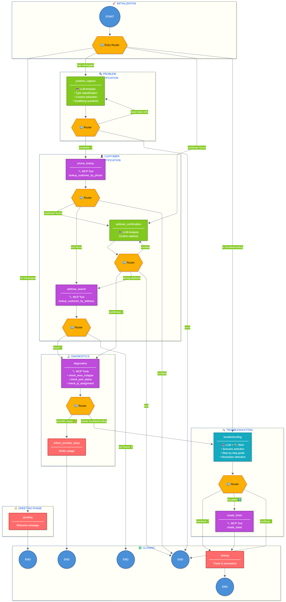
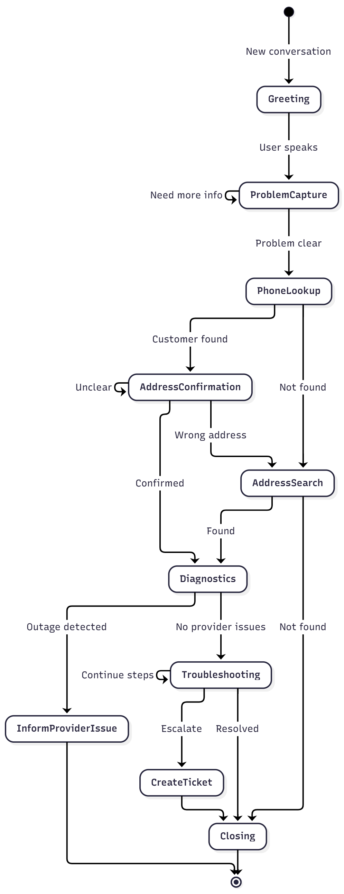

# Workflow Documentation

Complete reference for the LangGraph-based conversation workflow.

## Table of Contents

- [Overview](#overview)
- [Graph Structure](#graph-structure)
- [Entry Router](#entry-router)
- [Node Reference](#node-reference)
- [Routing Logic](#routing-logic)
- [State Transitions](#state-transitions)


---

## Overview

The agent uses LangGraph's `StateGraph` to manage conversation flow. Each node represents a distinct phase of customer interaction, with conditional routing determining the path through the graph.

**Key Concepts:**
- **Nodes** — Functions that process state and return updates
- **Routers** — Functions that determine the next node based on state
- **State** — Pydantic model tracking conversation context
- **Checkpointer** — MemorySaver for conversation persistence

**File Location:** `src/graph/graph.py`

---

## Graph Structure

### Visual Representation



### Conversation Phases

```
┌─────────────────────────────────────────────────────────────────────────────┐
│                        CONVERSATION FLOW                                     │
├─────────────────────────────────────────────────────────────────────────────┤
│                                                                              │
│  PHASE 1: GREETING                                                          │
│  ┌─────────┐                                                                │
│  │ START   │──▶ greeting ──▶ END (wait for user input)                     │
│  └─────────┘                                                                │
│                                                                              │
│  PHASE 2: PROBLEM IDENTIFICATION                                            │
│  ┌─────────┐    ┌─────────────────┐                                         │
│  │  User   │──▶ │ problem_capture │◀─┐                                      │
│  │ Input   │    │                 │  │ (loop until clear)                   │
│  └─────────┘    └────────┬────────┘──┘                                      │
│                          │                                                   │
│                          ▼                                                   │
│  PHASE 3: CUSTOMER IDENTIFICATION                                           │
│                 ┌──────────────┐                                            │
│                 │ phone_lookup │                                            │
│                 └──────┬───────┘                                            │
│                        │                                                     │
│         ┌──────────────┼──────────────┐                                     │
│         ▼              ▼              ▼                                     │
│  ┌────────────┐ ┌────────────┐ ┌─────────────┐                              │
│  │ address_   │ │ address_   │ │  (multi     │                              │
│  │confirmation│ │ search     │ │  address)   │                              │
│  └─────┬──────┘ └─────┬──────┘ └─────────────┘                              │
│        │              │                                                      │
│        └──────┬───────┘                                                      │
│               ▼                                                              │
│  PHASE 4: DIAGNOSTICS                                                        │
│        ┌─────────────┐                                                       │
│        │ diagnostics │                                                       │
│        └──────┬──────┘                                                       │
│               │                                                              │
│        ┌──────┴──────┐                                                       │
│        ▼             ▼                                                       │
│  ┌───────────┐ ┌─────────────────┐                                          │
│  │ provider  │ │ troubleshooting │◀─┐                                       │
│  │ issue     │ │                 │  │ (guided steps)                        │
│  └─────┬─────┘ └────────┬────────┘──┘                                       │
│        │                │                                                    │
│        ▼                ├──────────────┐                                     │
│       END               ▼              ▼                                     │
│                   ┌──────────┐  ┌─────────────┐                              │
│  PHASE 5:        │ closing  │  │create_ticket│                              │
│  RESOLUTION      └────┬─────┘  └──────┬──────┘                              │
│                       │               │                                      │
│                       └───────┬───────┘                                      │
│                               ▼                                              │
│                              END                                             │
│                                                                              │
└─────────────────────────────────────────────────────────────────────────────┘
```

---

## Entry Router

The entry router determines which node to activate based on current conversation state.

**File:** `src/graph/graph.py`

```python
def entry_router(state) -> str:
    """Determine entry point based on conversation state."""
    
    messages = _get_messages(state)
    
    # New conversation - start with greeting
    if not messages:
        return "greeting"
    
    # Already in troubleshooting flow
    if troubleshooting_scenario_id:
        return "troubleshooting"
    
    # Diagnostics completed, continue troubleshooting
    if diagnostics_completed:
        return "troubleshooting"
    
    # In address search flow
    if customer_id is None and problem_description and address_search_successful is None:
        return "address_search"
    
    # Customer found but address not confirmed
    if customer_id and address_confirmed is None:
        return "address_confirmation"
    
    # Default: continue problem capture
    return "problem_capture"
```

### Entry Router Decision Tree

```
                    ┌─────────────────┐
                    │  Entry Router   │
                    └────────┬────────┘
                             │
              ┌──────────────┼──────────────┐
              │              │              │
         no messages?   has scenario?   has customer?
              │              │              │
              ▼              ▼              ▼
         "greeting"   "troubleshooting"  check address
                                              │
                                    ┌─────────┴─────────┐
                                    │                   │
                              confirmed?          not confirmed?
                                    │                   │
                                    ▼                   ▼
                            "diagnostics"    "address_confirmation"
```

---

## Node Reference

### Overview Table

| Node | Purpose | Technology | Input | Output |
|------|---------|------------|-------|--------|
| `greeting` | Welcome message | Static config | Empty state | Welcome message |
| `problem_capture` | Classify & extract problem | LLM | User message | problem_type, problem_context |
| `phone_lookup` | Find customer by phone | MCP Tool | phone_number | customer_id, addresses |
| `address_confirmation` | Verify service address | LLM | customer_addresses | address_confirmed |
| `address_search` | Search by address | MCP Tool | User-provided address | customer_id |
| `diagnostics` | Check network status | MCP Tools | customer_id | diagnostic_results |
| `inform_provider_issue` | Notify about outage | Static | diagnostic_results | Outage message |
| `troubleshooting` | Guide through fixes | LLM + RAG | problem_context | Resolution or escalation |
| `create_ticket` | Generate support ticket | MCP Tool | Conversation context | ticket_id |
| `closing` | End conversation | Static | Resolution status | Farewell message |

---

### Detailed Node Descriptions

#### 1. greeting

**Purpose:** Display welcome message to start conversation.

**File:** `src/graph/nodes/greeting.py`

```python
def greeting_node(state: State) -> dict:
    """Display welcome message from configuration."""
    welcome_msg = get_message("greeting", "welcome")
    return {
        "messages": [add_message("assistant", welcome_msg, "greeting")],
        "current_node": "greeting"
    }
```

**Routing:** Always → END (waits for user input)

---

#### 2. problem_capture

**Purpose:** Extract and qualify customer's problem using LLM analysis.

**File:** `src/graph/nodes/problem_capture.py`

**LLM Schema:**
```python
class ProblemAnalysis(BaseModel):
    problem_type: Literal["internet", "tv", "phone", "billing", "other"]
    problem_summary: str
    known_facts: dict[str, Any]  # Extracted context
    context_score: int           # 0-100 completeness
    ready_to_proceed: bool
    next_question: str | None    # If more info needed
```

**Logic Flow:**
```
User Message
     │
     ▼
┌─────────────────┐
│  Keyword Check  │ ──▶ Detect problem type hints
└────────┬────────┘
         │
         ▼
┌─────────────────┐
│   LLM Analysis  │ ──▶ Extract facts, calculate score
└────────┬────────┘
         │
         ▼
┌─────────────────┐
│  Score >= 70?   │
└────────┬────────┘
         │
    ┌────┴────┐
    │         │
   YES        NO
    │         │
    ▼         ▼
 PROCEED   ASK QUESTION
            (max 3)
```

**Routing:**
- `context_score >= threshold` → `phone_lookup`
- `questions < max` → `problem_capture` (loop)
- `error` → `end`

---

#### 3. phone_lookup

**Purpose:** Find customer in CRM using phone number from caller ID.

**File:** `src/graph/nodes/phone_lookup.py`

**MCP Tool:** `lookup_customer_by_phone`

#### 4. address_confirmation

**Purpose:** Verify that we have the correct service address.

**File:** `src/graph/nodes/address_confirmation.py`

**LLM Task:** Analyze user response to determine if they confirm the address.


**Routing:**
- `confirmed = True` → `diagnostics`
- `confirmed = False` → `address_search`
- `confirmed = None` → `address_confirmation` (ask again, max 2 times)

---

#### 5. address_search

**Purpose:** Find customer using address when phone lookup fails.

**File:** `src/graph/nodes/address_search.py`

**MCP Tool:** `lookup_customer_by_address`


**Features:**
- Fuzzy street name matching
- Lithuanian character handling
- Partial match suggestions

**Routing:**
- Found → `diagnostics`
- Not found → `closing` (cannot help without customer ID)

---

#### 6. diagnostics

**Purpose:** Check for provider-side network issues before troubleshooting.

**File:** `src/graph/nodes/diagnostics.py`

**MCP Tools:**
1. `check_area_outages` - Regional outages
2. `check_port_status` - Customer port status
3. `check_ip_assignment` - DHCP/IP issues


**Routing:**
- `provider_issue_detected = True` → `inform_provider_issue`
- `provider_issue_detected = False` → `troubleshooting`

---

#### 7. inform_provider_issue

**Purpose:** Notify customer about known provider-side issues.

**File:** `src/graph/nodes/inform_provider_issue.py`

**Message Content:**
- Issue type (outage, maintenance)
- Estimated fix time
- Apology
- Ticket offer

**Routing:** Always → END

---

#### 8. troubleshooting

**Purpose:** Guide customer through step-by-step troubleshooting.

**File:** `src/graph/nodes/troubleshooting.py`

**Components:**
- RAG scenario selection
- Smart step routing
- Resolution detection
- Help request handling

**LLM Schema:**
```python
class ResolutionCheck(BaseModel):
    problem_resolved: bool
    confidence: float
    resolution_type: str | None  # "user_confirmed" | "implicit"
    
    step_completed: bool
    step_outcome: str           # "success" | "failed" | "needs_help"
    
    user_needs_help: bool
    escalation_needed: bool
    escalation_reason: str | None
```

**Flow:**
```
┌─────────────────┐
│ Select Scenario │ ◀── RAG + Smart Routing
└────────┬────────┘
         │
         ▼
┌─────────────────┐
│  Present Step   │
└────────┬────────┘
         │
         ▼
┌─────────────────┐
│  User Response  │
└────────┬────────┘
         │
         ▼
┌─────────────────┐
│ Analyze Result  │ ◀── LLM
└────────┬────────┘
         │
    ┌────┼────┬────────┐
    │    │    │        │
 RESOLVED HELP NEXT  ESCALATE
    │    │    │        │
    ▼    ▼    ▼        ▼
closing help next  create_ticket
       msg  step
```

**Routing:**
- `problem_resolved = True` → `closing`
- `escalation_needed = True` → `create_ticket`
- Otherwise → END (wait for user)


---

#### 9. create_ticket

**Purpose:** Create support ticket for technician escalation.

**File:** `src/graph/nodes/create_ticket.py`

**MCP Tool:** `create_ticket`

**Routing:** Always → `closing`

---

#### 10. closing

**Purpose:** End conversation gracefully with summary.

**File:** `src/graph/nodes/closing.py`

**Message Variations:**
- Problem resolved → Thank you message
- Ticket created → Ticket ID and next steps
- Not resolved → Apology and alternatives

**Routing:** Always → END

---

## Routing Logic

### Complete Routing Table

| Current Node | Condition | Next Node |
|-------------|-----------|-----------|
| START | `no messages` | `greeting` |
| START | `has messages` | `problem_capture` |
| START | `troubleshooting_scenario_id` | `troubleshooting` |
| START | `customer_id and not address_confirmed` | `address_confirmation` |
| `greeting` | Always | END |
| `problem_capture` | `problem_capture_complete` | `phone_lookup` |
| `problem_capture` | `questions < max` | `problem_capture` |
| `problem_capture` | Error | END |
| `phone_lookup` | Customer found (single address) | `address_confirmation` |
| `phone_lookup` | Customer found (multiple) | END (TODO) |
| `phone_lookup` | Not found | `address_search` |
| `address_confirmation` | Confirmed | `diagnostics` |
| `address_confirmation` | Wrong address | `address_search` |
| `address_confirmation` | Unclear | `address_confirmation` |
| `address_search` | Found | `diagnostics` |
| `address_search` | Not found | END |
| `diagnostics` | Provider issue | `inform_provider_issue` |
| `diagnostics` | No issues | `troubleshooting` |
| `inform_provider_issue` | Always | END |
| `troubleshooting` | Resolved | `closing` |
| `troubleshooting` | Escalate | `create_ticket` |
| `troubleshooting` | Continue | END |
| `create_ticket` | Always | `closing` |
| `closing` | Always | END |

---

## State Transitions


-