# ISP Customer Service Chatbot - Workflow Architecture

## 📋 Overview

This document describes the complete LangGraph workflow architecture for the ISP customer service chatbot. The workflow handles customer interactions from greeting to problem resolution or ticket creation.

**Key Features:**
- 10 nodes handling different conversation stages
- 7 routers for conditional flow control
- Multi-language support (LT/EN) via i18n
- Structured logging with conversation_id
- Error recovery with fallbacks

---

## 🗺️ Complete Flow Diagram

```mermaid
flowchart TD
    subgraph Entry["🚀 ENTRY POINT"]
        Start([START]) --> EntryRouter{entry_router}
    end

    subgraph Greeting["👋 GREETING"]
        EntryRouter -->|"no messages"| Greeting_Node[greeting]
        Greeting_Node --> END1([END])
    end

    subgraph ProblemCapture["🎯 PROBLEM CAPTURE"]
        EntryRouter -->|"has messages,<br/>no problem_description"| ProblemCapture_Node[problem_capture]
        ProblemCapture_Node --> PCRouter{problem_capture_router}
        PCRouter -->|"waiting for user"| END2([END])
        PCRouter -->|"problem identified"| PhoneLookup_Node[phone_lookup]
        PCRouter -->|"loop: need more info"| ProblemCapture_Node
    end

    subgraph CustomerIdentification["👤 CUSTOMER IDENTIFICATION"]
        PhoneLookup_Node --> PLRouter{phone_lookup_router}
        PLRouter -->|"1 address found"| AddressConfirm[address_confirmation]
        PLRouter -->|"multiple addresses"| AddressSelect[address_selection<br/>TODO]
        PLRouter -->|"not found"| AddressSearch[address_search]
        
        AddressConfirm --> ACRouter{address_confirmation_router}
        ACRouter -->|"confirmed"| Diagnostics_Node[diagnostics]
        ACRouter -->|"rejected"| AddressSearch
        ACRouter -->|"waiting"| END3([END])
        ACRouter -->|"loop: clarify"| AddressConfirm
        
        AddressSearch --> ASRouter{address_search_router}
        ASRouter -->|"found"| Diagnostics_Node
        ASRouter -->|"not found"| Closing_Direct[closing]
        ASRouter -->|"waiting"| END4([END])
    end

    subgraph Diagnostics["🔍 DIAGNOSTICS"]
        EntryRouter -->|"diagnostics_completed"| Troubleshooting_Node
        Diagnostics_Node --> DiagRouter{diagnostics_router}
        DiagRouter -->|"provider_issue<br/>(area outage)"| InformIssue[inform_provider_issue]
        DiagRouter -->|"client_side<br/>(needs troubleshooting)"| Troubleshooting_Node[troubleshooting]
        InformIssue --> END5([END])
    end

    subgraph Troubleshooting["🔧 TROUBLESHOOTING"]
        EntryRouter -->|"troubleshooting_scenario_id"| Troubleshooting_Node
        Troubleshooting_Node --> TSRouter{troubleshooting_router}
        TSRouter -->|"needs_escalation"| CreateTicket[create_ticket]
        TSRouter -->|"problem_resolved"| Closing_Node[closing]
        TSRouter -->|"waiting for user"| END6([END])
    end

    subgraph Resolution["✅ RESOLUTION"]
        CreateTicket --> Closing_Node
        Closing_Node --> END7([END])
        Closing_Direct --> END8([END])
    end

    %% Re-entry points
    EntryRouter -->|"address_confirmed=None"| AddressConfirm
    EntryRouter -->|"in address_search flow"| AddressSearch

    %% Styling
    style EntryRouter fill:#FFD700,stroke:#333,stroke-width:2px
    style PCRouter fill:#FFD700,stroke:#333,stroke-width:2px
    style PLRouter fill:#FFD700,stroke:#333,stroke-width:2px
    style ACRouter fill:#FFD700,stroke:#333,stroke-width:2px
    style ASRouter fill:#FFD700,stroke:#333,stroke-width:2px
    style DiagRouter fill:#FFD700,stroke:#333,stroke-width:2px
    style TSRouter fill:#FFD700,stroke:#333,stroke-width:2px
    
    style Greeting_Node fill:#90EE90,stroke:#333
    style Closing_Node fill:#90EE90,stroke:#333
    style Closing_Direct fill:#90EE90,stroke:#333
    
    style InformIssue fill:#FFB6C1,stroke:#333
    style CreateTicket fill:#FFB6C1,stroke:#333
```



---

## 📊 Simplified Flow Diagram


---

## 📦 Nodes Reference

### 1. `greeting` - Entry Point
| Property | Value |
|----------|-------|
| **Purpose** | Greet customer on first contact |
| **LLM Call** | ❌ No |
| **Input** | None |
| **Output** | Welcome message |
| **Next** | → `END` (wait for user) |

```python
# Example output (LT)
"Labas, čia ISP Lietuva klientų aptarnavimas. Mano vardas Andrius. Kuo galiu jums padėti?"

# Example output (EN)  
"Hello, this is ISP Lithuania customer service. My name is Andrew. How can I help you?"
```

---

### 2. `problem_capture` - Problem Analysis
| Property | Value |
|----------|-------|
| **Purpose** | Classify problem type, extract context |
| **LLM Call** | ✅ Yes (analysis) |
| **Input** | User message |
| **Output** | Problem type, description, context score |
| **Router** | `problem_capture_router` |

**Router Logic:**
```
problem_capture_router:
├── "end"           → problem NOT clear, asked question, wait for user
├── "phone_lookup"  → problem identified, proceed to customer lookup
└── "problem_capture" → loop (legacy/error case)
```

**State Updates:**
- `problem_type`: internet | tv | phone | billing | other
- `problem_description`: Summary of problem
- `problem_context`: Extracted facts dict
- `problem_capture_complete`: bool

---

### 3. `phone_lookup` - Customer Identification
| Property | Value |
|----------|-------|
| **Purpose** | Find customer in CRM by phone number |
| **LLM Call** | ❌ No |
| **Input** | `phone_number` from state |
| **Output** | Customer data, addresses |
| **Router** | `phone_lookup_router` |

**Router Logic:**
```
phone_lookup_router:
├── "address_confirmation" → 1 address found
├── "address_selection"    → multiple addresses (TODO)
└── "address_search"       → customer not found by phone
```

**State Updates:**
- `customer_id`: CRM customer ID
- `customer_name`: Full name
- `customer_addresses`: List of addresses

---

### 4. `address_confirmation` - Verify Address
| Property | Value |
|----------|-------|
| **Purpose** | Ask customer to confirm their address |
| **LLM Call** | ✅ Yes (response analysis) |
| **Input** | Customer addresses, user response |
| **Output** | Confirmation question or result |
| **Router** | `address_confirmation_router` |

**Router Logic:**
```
address_confirmation_router:
├── "diagnostics"          → address confirmed ✅
├── "address_search"       → address rejected, need different address
├── "address_confirmation" → loop (clarification needed)
└── "end"                  → waiting for user response
```

**State Updates:**
- `address_confirmed`: bool
- `confirmed_address_id`: Address ID
- `confirmed_address`: Full address string

---

### 5. `address_search` - Manual Address Lookup
| Property | Value |
|----------|-------|
| **Purpose** | Ask for and lookup address when phone lookup fails |
| **LLM Call** | ✅ Yes (address extraction) |
| **Input** | User message with address |
| **Output** | Found customer or not found message |
| **Router** | `address_search_router` |

**Router Logic:**
```
address_search_router:
├── "diagnostics" → customer found by address ✅
├── "closing"     → customer not found, end conversation
└── "end"         → waiting for address input
```

---

### 6. `diagnostics` - Network Check
| Property | Value |
|----------|-------|
| **Purpose** | Check for provider-side issues (outages, port status) |
| **LLM Call** | ❌ No (MCP call to network service) |
| **Input** | `customer_id` |
| **Output** | Diagnostic results, issues list |
| **Router** | `diagnostics_router` |

**Router Logic:**
```
diagnostics_router:
├── "inform_provider_issue" → area outage detected 🔴
└── "troubleshooting"       → no provider issue, try troubleshooting
```

**State Updates:**
- `diagnostics_completed`: bool
- `provider_issue_detected`: bool
- `diagnostic_results`: Results dict

---

### 7. `inform_provider_issue` - Explain Outage
| Property | Value |
|----------|-------|
| **Purpose** | Inform customer about provider-side issues |
| **LLM Call** | ❌ No |
| **Input** | `diagnostic_results` |
| **Output** | Outage explanation message |
| **Next** | → `END` |

**State Updates:**
- `provider_issue_informed`: bool

---

### 8. `troubleshooting` - Guided Resolution
| Property | Value |
|----------|-------|
| **Purpose** | Guide customer through troubleshooting steps |
| **LLM Call** | ✅ Yes (multiple: help, analysis, resolution check) |
| **Input** | User responses, scenario steps |
| **Output** | Step instructions, help, apologies |
| **Router** | `troubleshooting_router` |

**Router Logic:**
```
troubleshooting_router:
├── "create_ticket" → escalation needed (customer request, no solution, frustration)
├── "closing"       → problem resolved ✅
└── "end"           → waiting for user response to step
```

**Features:**
- Help request detection → detailed explanations
- Frustration detection → apologies, offer escalation
- Resolution detection → confirm and close
- Step branching based on user answers

**State Updates:**
- `troubleshooting_scenario_id`: Active scenario
- `troubleshooting_current_step`: Current step ID
- `troubleshooting_completed_steps`: List of done steps
- `troubleshooting_needs_escalation`: bool
- `troubleshooting_escalation_reason`: Why escalating
- `problem_resolved`: bool

---

### 9. `create_ticket` - CRM Ticket
| Property | Value |
|----------|-------|
| **Purpose** | Create support ticket in CRM |
| **LLM Call** | ❌ No (MCP call to CRM) |
| **Input** | Customer info, problem details |
| **Output** | Ticket confirmation (for escalation) or silent (for resolved) |
| **Next** | → `closing` |

**State Updates:**
- `ticket_created`: bool
- `ticket_id`: Ticket number
- `ticket_type`: "resolved" | "technician_visit"

---

### 10. `closing` - End Conversation
| Property | Value |
|----------|-------|
| **Purpose** | Say goodbye with appropriate message |
| **LLM Call** | ❌ No |
| **Input** | Conversation outcome flags |
| **Output** | Closing message based on scenario |
| **Next** | → `END` |

**Closing Scenarios:**
| Condition | Message Type |
|-----------|--------------|
| `problem_resolved=True` | Happy resolution |
| `ticket_created=True` | Technician will contact |
| `provider_issue_informed=True` | Service will restore automatically |
| Fallback | Generic goodbye |

**State Updates:**
- `conversation_ended`: True

---

## 🔀 Entry Router Logic

The `entry_router` determines which node to enter based on conversation state:

```python
def entry_router(state) -> str:
    """
    Priority order for determining entry point:
    """
    
    # 1. First message → greeting
    if not messages:
        return "greeting"
    
    # 2. In troubleshooting flow → continue troubleshooting
    if troubleshooting_scenario_id:
        return "troubleshooting"
    
    # 3. Diagnostics done → troubleshooting
    if diagnostics_completed:
        return "troubleshooting"
    
    # 4. In address search flow
    if customer_id is None and problem_description and address_search_successful is None:
        return "address_search"
    
    # 5. Customer found but address not confirmed
    if customer_id and address_confirmed is None:
        return "address_confirmation"
    
    # 6. Default → problem capture
    return "problem_capture"
```

---

## 🔄 Conversation Flow Examples

### Example 1: Happy Path (Problem Resolved)
```
User: [calls]
→ greeting: "Labas, čia ISP Lietuva..."

User: "Neveikia internetas"
→ problem_capture: "Suprantu, turite interneto problemą. Tikrinu..."
→ phone_lookup: [finds customer]
→ address_confirmation: "Ar jūsų adresas yra Vilnius, Gedimino 1?"

User: "Taip"
→ diagnostics: "Tikrinu jūsų ryšį..."
→ troubleshooting: "Pabandykime perkrauti routerį..."

User: "Padariau, dabar veikia!"
→ closing: "Džiaugiuosi, kad pavyko išspręsti! Geros dienos!"
```

### Example 2: Escalation Path
```
User: [calls]
→ greeting: "Labas..."

User: "Jau 3 dienas neveikia internetas, viską bandžiau"
→ problem_capture: "Suprantu... Tikrinu..."
→ phone_lookup: [finds customer]
→ address_confirmation: "Ar adresas Kaunas, Laisvės 5?"

User: "Taip"
→ diagnostics: [no provider issues]
→ troubleshooting: "Pabandykime..."

User: "Noriu kalbėti su žmogumi, atsibodo!"
→ troubleshooting: [detects frustration]
→ create_ticket: [creates ticket]
→ closing: "Technikas susisieks su jumis. Numeris: TKT-12345."
```

### Example 3: Provider Outage
```
User: [calls]
→ greeting: "Hello, this is ISP..."

User: "Internet not working"
→ problem_capture: "I understand..."
→ phone_lookup → address_confirmation → [confirmed]
→ diagnostics: [DETECTS AREA OUTAGE]
→ inform_provider_issue: "There's currently an outage in your area..."
→ END
```

---

## 📁 File Structure

```
chatbot_core/src/
├── graph/
│   ├── graph.py              # Main workflow definition
│   ├── state.py              # Pydantic state schema
│   └── nodes/
│       ├── __init__.py       # Exports all nodes/routers
│       ├── greeting.py
│       ├── problem_capture.py
│       ├── phone_lookup.py
│       ├── address_confirmation.py
│       ├── address_search.py
│       ├── diagnostics.py
│       ├── inform_provider_issue.py
│       ├── troubleshooting.py
│       ├── create_ticket.py
│       └── closing.py
│
├── services/
│   ├── __init__.py
│   ├── language_service.py   # Language management (LT/EN)
│   ├── translation_service.py # t() function, YAML loading
│   ├── llm.py               # LLM completion calls
│   ├── crm.py               # CRM MCP wrapper
│   └── network.py           # Network diagnostics MCP wrapper
│
└── config/
    ├── i18n/
    │   ├── lt/
    │   │   ├── messages.yaml # Lithuanian messages
    │   │   └── phrases.yaml  # Lithuanian phrases
    │   └── en/
    │       ├── messages.yaml # English messages
    │       └── phrases.yaml  # English phrases
    └── prompts/
        └── problem_capture/
            └── analyze_problem.txt
```

---

## 🔧 State Schema (Key Fields)

```python
class State(BaseModel):
    # Messages
    messages: list[Message] = []
    
    # Conversation
    conversation_id: str | None = None
    current_node: str | None = None
    conversation_ended: bool = False
    
    # Customer
    phone_number: str | None = None
    customer_id: str | None = None
    customer_name: str | None = None
    customer_addresses: list[dict] = []
    
    # Address
    address_confirmed: bool | None = None
    confirmed_address_id: str | None = None
    confirmed_address: str | None = None
    address_search_successful: bool | None = None
    
    # Problem
    problem_type: str | None = None  # internet|tv|phone|billing|other
    problem_description: str | None = None
    problem_context: dict = {}
    problem_capture_complete: bool = False
    
    # Diagnostics
    diagnostics_completed: bool = False
    provider_issue_detected: bool = False
    diagnostic_results: dict = {}
    provider_issue_informed: bool = False
    
    # Troubleshooting
    troubleshooting_scenario_id: str | None = None
    troubleshooting_current_step: str | None = None
    troubleshooting_completed_steps: list[str] = []
    troubleshooting_needs_escalation: bool = False
    troubleshooting_escalation_reason: str | None = None
    problem_resolved: bool = False
    
    # Ticket
    ticket_created: bool = False
    ticket_id: str | None = None
    
    # Errors
    last_error: str | None = None
    llm_error_count: int = 0
```

---

## 🌐 Language Support

### Setting Language (from UI)
```python
from src.services.language_service import set_language

# On conversation start, based on UI setting
set_language("lt")  # Lithuanian
set_language("en")  # English
```

### How It Works
1. **Static messages** → loaded from `i18n/{lang}/messages.yaml`
2. **LLM prompts** → English prompts with `{output_language}` instruction
3. **Phrase detection** → loaded from `i18n/{lang}/phrases.yaml`

```python
# In any node:
from src.services.translation_service import t, t_list

# Get message
message = t("greeting.welcome", company_name="ISP", agent_name="Andrius")

# Get phrase list for detection
yes_phrases = t_list("confirmation.yes")
```

---

## 🚦 Edge Cases Handled

| Scenario | Handling |
|----------|----------|
| Customer not found by phone | → `address_search` node |
| Customer not found by address | → `closing` with apology |
| Provider outage detected | → `inform_provider_issue`, skip troubleshooting |
| User asks for help | → Detailed explanation of current step |
| User frustrated | → Apology + offer escalation |
| User requests human | → Immediate ticket creation |
| LLM error (3x) | → Conversation ends with apology |
| No more troubleshooting steps | → Escalation to technician |

---

## 📝 Notes

1. **`address_selection`** node is TODO - currently routes to END
2. **`closing_router`** for "more help" loop is not implemented - conversation ends
3. **Checkpointer** uses in-memory `MemorySaver` - consider persistence for production
4. **Entry router** allows re-entry to mid-conversation states (address_confirmation, troubleshooting)

---

## 🔄 Version History

| Version | Date | Changes |
|---------|------|---------|
| v3.0 | 2024-12 | Added i18n support, structured logging, error handling |
| v2.0 | 2024-11 | Added troubleshooting scenarios, frustration detection |
| v1.0 | 2024-10 | Initial workflow with basic nodes |
